# QUANTA Operational Refactor Plan: Phased Neuro-Symbolic Implementation

> **Status:** Active Operational Blueprint  
> **Target Architecture:** QUANTA Neuro-Symbolic Cognitive Engine  
> **Baseline Test Suite:** 268 passed (`pytest tests/`)  
> **Execution Strategy:** 5 Phased Milestones with Strict Test Boundaries  

---

## 1. Executive Summary & Architectural Rationale

QUANTA departs from conventional autoregressive LLMs by separating linguistic surface translation from internal symbolic reasoning. Autoregressive language models operating over continuous vector representations ($\mathbb{R}^d$) suffer from representation collapse, continuous noise drift across multi-hop reasoning chains, and structural hallucinations due to the absence of formal validity constraints.

To eliminate these vulnerabilities while operating efficiently on consumer-grade hardware (NVIDIA RTX 3070 8GB VRAM / 16GB Host RAM), QUANTA establishes a **Decoupled Two-Pass SLM Transduction & Formal Verification Architecture**:
1. **Lightweight Small Language Models (SLMs)** (e.g., Qwen 3.5 4B/2B with hybrid linear attention or Gemma 4 with native Multi-Token Prediction) serve strictly as external syntactic transducers.
2. Decoding is constrained via a formal **GBNF (GGML BNF) Grammar** to emit compact, typed **S-Expressions** ($4\times$ token reduction over JSON-LD, zero syntax errors at logit mask level).
3. S-expression ASTs are stitched into a continuous Entity-Event Directed Acyclic Graph (DAG) across narrative chunks.
4. The stitched DAG is compiled deterministically into a 1024-dimension quaternary vector space ($\Sigma^{1024} = \{0, 1, 2, 3\}^{1024}$, 256 bytes per node) and checked by an Answer Set Programming (**PyClingo / $s(\text{CASP})$**) verification gate.
5. If contradictions arise, the solver extracts a **Minimal Unsatisfiable Core (MUC)** and initiates a closed-loop prompt repair cycle (strictly capped at 2 repair attempts).

### Phased Delivery Overview

```mermaid
flowchart TD
    subgraph Phase1["Phase 1: Representation & Parsing Core"]
        direction TB
        G["GBNF Grammar Specification<br/>data/grammar/quanta_asg.gbnf"]
        P["S-Expression Parser & AST Converter<br/>src/parser/sexpr_parser.py"]
        T1["Unit Tests & Roundtrip Verification<br/>tests/test_sexpr_parser.py"]
        G --> P --> T1
    end

    subgraph Phase2["Phase 2: Local Neural Transduction Backend"]
        direction TB
        U["Unsloth Grammar Transducer<br/>src/parser/unsloth_transducer.py"]
        M["Deterministic Offline Mock<br/>MockUnslothTransducer"]
        T2["Transducer Integration Tests<br/>tests/test_unsloth_transducer.py"]
        U --> M --> T2
    end

    subgraph Phase3["Phase 3: Multi-Chunk Graph Stitcher"]
        direction TB
        S["Multi-Chunk DAG Stitcher<br/>src/parser/graph_stitcher.py"]
        R["Global Entity Resolution & Temporal Intervals"]
        T3["Multi-Chunk Integration Tests<br/>tests/test_graph_stitcher.py"]
        S --> R --> T3
    end

    subgraph Phase4["Phase 4: Formal Verification & MUC Closed-Loop Repair"]
        direction TB
        C["Clingo MUC Verification Gate<br/>src/verification/clingo_gate.py"]
        L["Closed-Loop MUC Repair Manager<br/>(Capped at <= 2 Retries)"]
        T4["MUC Extraction & Repair Tests<br/>tests/test_muc_repair.py"]
        C --> L --> T4
    end

    subgraph Phase5["Phase 5: Unified Cognitive Pipeline Integration"]
        direction TB
        CP["End-to-End Cognitive Pipeline<br/>src/pipeline/cognitive_pipeline.py"]
        T5["Full System Regression & Stress Tests<br/>pytest tests/"]
        CP --> T5
    end

    Phase1 --> Phase2 --> Phase3 --> Phase4 --> Phase5
```



---

## Phase 1: Representation & Parsing Core (Grammar & S-Expression AST)

### Goal
Establish the formal GGML/GBNF grammar specification and a high-performance recursive-descent S-expression lexer, parser, AST converter, and serializer. S-expressions must convert directly to and from `DiscourseExtractionResult` (`src/parser/schema.py`) and compile seamlessly into `QuantaGraph` (`src/core/asg.py`) via `ASGCompiler` (`src/parser/asg_compiler.py`).

### Architectural Context
JSON-LD and raw property graphs waste 60%–75% of generation tokens on syntax boilerplate (`{"@type": "Entity", "properties": ...}`). By constraining the SLM to S-expressions via GBNF, we achieve:
1. **$4\times$ Token Compression**: S-expressions replace key-value JSON framing with positional keywords (`:id`, `:type`, `:pred`, `:agent`).
2. **Grammar-Level Validity**: Syntax errors are physically impossible during model decoding because invalid tokens are masked out by the logits processor.
3. **Lossless Interoperability**: Direct mapping to `DiscourseExtractionResult` guarantees zero friction with existing 1024-D quaternary vector compilation, WordNet/ConceptNet 5.7.0 grounding, and Merkle CID calculation.

### Target Files
- **[NEW]** `data/grammar/quanta_asg.gbnf`: Formal GBNF grammar specification.
- **[NEW]** `src/parser/sexpr_parser.py`: Lexer, Parser, AST Converter, Serializer, and Compiler Bridge.
- **[NEW]** `tests/test_sexpr_parser.py`: Comprehensive unit tests.
- **[MODIFY]** `src/parser/__init__.py`: Export new parser interfaces.

### Technical Specification
1. **GBNF Grammar (`data/grammar/quanta_asg.gbnf`)**:
   - `root ::= ws "(" ws "graph" ws (clause ws)* ")" ws`
   - `clause ::= entity_clause | event_clause | relation_clause | prop_clause`
   - `entity_clause ::= "(" ws "entity" ws ":id" ws id ws ":type" ws type ws ":label" ws string ws ":surface" ws string (ws ":props" ws prop_list)? ws ")"`
   - `event_clause ::= "(" ws "event" ws ":id" ws id ws ":pred" ws id (ws ":agent" ws id)? (ws ":patient" ws id)? (ws ":theme" ws id)? (ws ":location" ws id)? (ws ":instrument" ws id)? (ws ":time" ws time_expr)? (ws ":val" ws boolean)? (ws ":tense" ws tense)? (ws ":polarity" ws boolean)? ws ")"`
   - `relation_clause ::= "(" ws "relation" ws ":type" ws rel_type ws ":source" ws id ws ":target" ws id (ws ":mechanism" ws string)? ws ")"`
   - `prop_clause ::= "(" ws "proposition" ws ":id" ws id ws ":claim" ws string (ws ":subject" ws id)? (ws ":status" ws status)? (ws ":source" ws id)? ws ")"`
   - Explicit terminal definitions for `id`, `string` (escaped characters), `boolean` (`TRUE` | `FALSE`), and whitespace.

2. **Lexer & Parser (`src/parser/sexpr_parser.py`)**:
   - `SExprTokenType`: `LPAREN`, `RPAREN`, `KEYWORD` (e.g. `:id`), `SYMBOL` (e.g. `HUMAN`, `TRUE`, `nil`), `STRING`, `NUMBER`, `COMMENT`.
   - `SExprLexer`: Character-level tokenizer with exact line and column tracking for precise syntax diagnostics.
   - `SExprParser`: Recursive-descent parser producing nested `SExprAtom` and `SExprList` tree structures.
   - `SExprASTConverter`: Maps `(graph ...)` S-expression nodes to `DiscourseExtractionResult`:
     - Entities $\to$ `ExtractedEntity` (id, canonical_name, category, surface_aliases).
     - Events $\to$ `ExtractedEvent` (id, predicate, agent_id, patient_id, theme_id, location_id, tense, polarity).
     - Relations $\to$ `ExtractedRelation` (relation_type, source_id, target_id, mechanism).
     - Propositions $\to$ `ExtractedProposition` (id, claim_text, epistemic_status, source_agent_id).
   - `to_sexpr(result: DiscourseExtractionResult) -> str`: Lossless canonical serialization.
   - `parse_to_asg(sexpr_str: str, compiler: Optional[ASGCompiler] = None) -> QuantaGraph`: Direct compilation bridge into 1024-D QuantaGraph.

### Acceptance Criteria & Verification
```powershell
pytest tests/test_sexpr_parser.py -v
```
- [x] Lexer correctly parses symbols, strings with escapes, and ignores comments (`;; ...`).
- [x] Parser throws informative syntax errors with line/column coordinates on unclosed parens or unexpected tokens.
- [x] Full round-trip fidelity: `parse_sexpr(to_sexpr(res)) == res` for arbitrary extraction results.
- [x] `parse_to_asg()` emits valid 1024-D `QuantaGraph` with correct BLAKE3 Merkle CIDs and thematic valencies.

---

## Phase 2: Local Neural Transduction Backend (Unsloth & GBNF Injection)

### Goal
Implement `UnslothTransducer` to invoke local SLMs (Qwen 3.5 4B/2B or Gemma 4) via an OpenAI-compatible endpoint (`http://localhost:8888/v1`) with native GBNF grammar injection. Provide a fully deterministic, offline `MockUnslothTransducer` to ensure offline and CI test resilience.

### Architectural Context
Ingestion requires fast, low-latency translation from raw English into S-expressions. By serving lightweight SLMs locally via Unsloth Desktop/Studio or vLLM at port 8888, the transducer avoids cloud API billing and executes in $< 40\text{ ms}$ per chunk.

### Target Files
- **[NEW]** `src/parser/unsloth_transducer.py`: Unsloth client with GBNF grammar injection and mock fallback.
- **[NEW]** `tests/test_unsloth_transducer.py`: Transducer unit and offline integration tests.
- **[MODIFY]** `src/parser/__init__.py`: Export `UnslothTransducer` and `MockUnslothTransducer`.

### Technical Specification
1. **`UnslothTransducer` Interface**:
   - Endpoint: Defaults to `http://localhost:8888/v1`, configurable via environment variable `UNSLOTH_BASE_URL` or constructor argument.
   - Grammar Auto-Injection: Automatically loads `data/grammar/quanta_asg.gbnf` and passes it in `extra_body={"grammar": gbnf_content}`.
   - System Prompt: Compact Mentalese transducer prompt with 1-shot in-context demonstration formatted as S-expressions.
   - Coreference Manifest: Injects `ACTIVE ENTITIES:` manifest into the prompt context to guide foreign key assignment.
   - Methods:
     - `transduce(text: str, active_entities: Optional[List[EntityRecord]] = None) -> DiscourseExtractionResult`
     - `transduce_raw(text: str, active_entities: Optional[List[EntityRecord]] = None) -> str`
     - `transduce_async(...)`
   - Fallback & Resilience: If the Unsloth server is unreachable and `fallback_to_mock=True`, automatically delegates to `MockUnslothTransducer` with a warning rather than crashing.

2. **`MockUnslothTransducer`**:
   - Provides deterministic S-expression generation for test fixtures (e.g., "Dr. Eleanor Vance", scientific paragraphs, causal narratives).
   - Generates compliant `(graph ...)` S-expressions dynamically when unknown text is passed.
   - Guarantees 100% offline test execution without requiring a live GPU server.

### Acceptance Criteria & Verification
```powershell
pytest tests/test_unsloth_transducer.py -v
```
- [x] Transducer correctly loads GBNF grammar and structures API request payloads.
- [x] Active entity manifest is rendered into system prompt and correctly influences entity IDs.
- [x] Mock transducer executes offline in $< 5\text{ ms}$ and produces valid, parseable S-expressions.
- [x] Graceful fallback occurs when Unsloth server is offline without unhandled socket exceptions.

---

## Phase 3: Multi-Chunk Graph Stitcher & Global Identity Consolidation

### Goal
Implement `GraphStitcher` to aggregate multiple single-chunk extraction results into a unified, coherent narrative Directed Acyclic Graph (DAG), performing global entity canonicalization, ID re-mapping, and cross-chunk Allen temporal interval synthesis.

### Architectural Context
A single discourse chunk (150–350 words) captures an isolated episode. Complex documents span dozens or hundreds of chunks. Passing an entire document to an LLM dilutes attention and inflates VRAM. `GraphStitcher` enables unlimited narrative length by stitching chunk DAGs incrementally in host RAM without context window saturation.

### Target Files
- **[NEW]** `src/parser/graph_stitcher.py`: `GraphStitcher` implementation.
- **[NEW]** `tests/test_graph_stitcher.py`: Unit tests for multi-chunk merging.
- **[MODIFY]** `src/parser/__init__.py`: Export `GraphStitcher`.

### Technical Specification
1. **Global Entity Resolution & Canonicalization**:
   - Ingests multiple `DiscourseExtractionResult` instances.
   - Manages a global symbol table: maps local IDs (`chunk_1:e1`, `chunk_2:e1`) to unique global IDs (`E1`, `E2`, etc.).
   - Matches entities using `ActiveEntityManifest` across surface aliases, canonical names, and ontological categories.
   - Merges newly discovered aliases and properties into the canonical entity record.

2. **Event & Relation Re-Mapping**:
   - Re-indexes event IDs across chunks (`Ev1`, `Ev2`, ...).
   - Updates all event foreign keys (`agent_id`, `patient_id`, `theme_id`, `location_id`, `instrument_id`) to point to the resolved global entity IDs.
   - Re-maps relation endpoints (`source_id`, `target_id`).

3. **Cross-Chunk Temporal Interval Synthesis**:
   - For sequential narrative chunks without explicit temporal gaps, synthesizes inter-chunk Allen temporal relations (`TEMP_ALLEN_MEETS` or `TEMP_ALLEN_BEFORE`) linking the terminal event of chunk $N$ to the initial event of chunk $N+1$.
   - Preserves DAG acyclicity and temporal monotonicity.

4. **Compilation Bridge**:
   - `stitch(chunks: List[DiscourseExtractionResult]) -> DiscourseExtractionResult`
   - `stitch_to_graph(chunks: List[DiscourseExtractionResult], compiler: Optional[ASGCompiler] = None) -> QuantaGraph`

### Acceptance Criteria & Verification
```powershell
pytest tests/test_graph_stitcher.py -v
```
- [x] Entities appearing across multiple chunks with different surface forms (e.g. "Dr. Vance" and "Eleanor") are unified into a single canonical entity with aggregated aliases.
- [x] All event arguments correctly reference the unified global entity IDs.
- [x] Inter-chunk Allen temporal relations are synthesized between adjacent chunks.
- [x] Stitched result compiles into a unified `QuantaGraph` with valid foreign keys and zero orphan nodes.

---

## Phase 4: Formal Verification Gate & Closed-Loop MUC Repair

### Goal
Implement `ClingoVerificationGate` to translate low-level Clingo assumption cores into model-actionable diagnostic explanations, and implement `MUCRepairManager` to orchestrate closed-loop prompt repair with a strict cap of maximum 2 repair attempts.

### Architectural Context
Neuro-symbolic architectures must guarantee zero structural hallucinations. While `ValidatorGate` (`src/solver/validator_gate.py`) extracts raw unsatisfiable slot tuples (`candidate_slot`), raw solver symbols are incomprehensible to an SLM. `ClingoVerificationGate` maps these slots into natural diagnostic instructions (e.g., ontological violations, temporal paradoxes, or causal clashes) that the SLM can immediately resolve.

### Target Files
- **[NEW]** `src/verification/__init__.py`: Package entry point.
- **[NEW]** `src/verification/clingo_gate.py`: `ClingoVerificationGate` and `MUCRepairManager`.
- **[NEW]** `tests/test_muc_repair.py`: Unit and integration tests for MUC diagnostics and repair loop.

### Technical Specification
1. **`ClingoVerificationGate` Diagnostic Translation**:
   - Wraps `ValidationGate` from `src/solver/validator_gate.py`.
   - Analyzes `ValidationResult.muc_slots` and `errors`:
     - **Ontological Violations**: Flags incompatible slot pairs (e.g., `TYPE_ABSTRACT_CONCEPT` + `ROLE_AGENT_CAPABLE` in literal modality $\to$ "Abstract concept cannot act as physical agent").
     - **Allen Temporal Contradictions**: Detects conflicting interval ordering (e.g., event $A$ precedes event $B$, yet $A$ start time is after $B$ end time).
     - **Causal Contradictions**: Flags simultaneous direct causation and preventive blocking.
   - Formats actionable `[REPAIR REQUEST]` prompt block:
     ```text
     [REPAIR REQUEST]
     Candidate sub-graph violated ontological axiom:
       CONFLICT: Entity 'Democracy' (abstract concept) cannot act as agent in event 'Ev1' (pressurize).
     Regenerate S-expression resolving the conflict.
     ```

2. **`MUCRepairManager` Closed-Loop Orchestration**:
   - Closed-loop repair cycle:
     1. Compile candidate S-expression to `QuantaGraph`.
     2. Run `ClingoVerificationGate.validate_graph(graph)`.
     3. If valid: Commit graph and return success.
     4. If invalid:
        - Increment repair counter for this chunk.
        - **Enforce Repair Cap**: If repair attempts $> 2$, halt and report unresolvable conflict cleanly without crashing.
        - Extract MUC diagnostic and generate `[REPAIR REQUEST]` block.
        - Re-prompt `UnslothTransducer` with repair context.
        - Re-parse S-expression and re-verify.

### Acceptance Criteria & Verification
```powershell
pytest tests/test_muc_repair.py -v
```
- [x] Intentional ontological conflict (e.g. abstract concept as agent) produces an explicit, readable `[REPAIR REQUEST]` diagnostic.
- [x] Intentional Allen temporal contradiction produces an ordering conflict diagnostic.
- [x] Mock repair simulation succeeds when the transducer fixes the violation on attempt 1.
- [x] Repair cap halts execution after exactly 2 failed attempts and returns informative error status.

---

## Phase 5: Unified Cognitive Pipeline Integration & Benchmark Validation

### Goal
Integrate all five operational modules into a unified `CognitivePipeline` entry point that processes arbitrary English text end-to-end (chunking $\to$ transduction $\to$ stitching $\to$ compilation $\to$ verification $\to$ realization) and verify zero regressions across the entire repository.

### Architectural Context
This phase completes the operational bridge, connecting the 3-pass ingestion pipeline to the existing reverse realizers (`EnglishRealizer`, `FOLEmitter`, `CodeEmitter`).

### Target Files
- **[NEW]** `src/pipeline/cognitive_pipeline.py`: Unified `CognitivePipeline` class.
- **[NEW]** `tests/test_cognitive_pipeline.py`: End-to-end pipeline integration tests.
- **[MODIFY]** `src/pipeline/__init__.py`: Export `CognitivePipeline`.

### Technical Specification
1. **`CognitivePipeline` Workflow**:
   - Ingests raw text (single sentence, paragraph, or multi-paragraph document).
   - Splits text into `DiscourseChunk` objects via `DiscourseChunker`.
   - Iterates chunks through `UnslothTransducer` with active entity tracking.
   - Stitches chunks via `GraphStitcher`.
   - Compiles and validates via `ASGCompiler` and `MUCRepairManager`.
   - Exposes clean export methods:
     - `process(text: str) -> QuantaGraph`
     - `to_english(graph: QuantaGraph) -> str`
     - `to_fol(graph: QuantaGraph) -> str`
     - `to_code(graph: QuantaGraph) -> str`
     - `to_sexpr(graph: QuantaGraph) -> str`

2. **Repository-Wide Regression Gate**:
   - Execute full test suite: all existing 268 tests + all newly added test suites must pass 100%.

### Acceptance Criteria & Verification
```powershell
pytest tests/ -v
```
- [ ] End-to-end execution of a multi-sentence narrative: text $\to$ S-expr $\to$ QuantaGraph $\to$ English NLG.
- [ ] All 268 baseline tests pass without regression.
- [ ] All new test files pass cleanly:
  - `tests/test_sexpr_parser.py`
  - `tests/test_unsloth_transducer.py`
  - `tests/test_graph_stitcher.py`
  - `tests/test_muc_repair.py`
  - `tests/test_cognitive_pipeline.py`

---

## 6. Implementation Schedule & Commit Protocol

Each phase will be implemented as an isolated, verified commit following the repository's Stacked Bushes governance (`AGENTS.md`):

| Phase | Milestone Name | Primary Deliverables | Target Commit Message |
|:---:|:---|:---|:---|
| **1** | Representation & Grammar Core | `quanta_asg.gbnf`, `sexpr_parser.py`, `test_sexpr_parser.py` | `feat(parser): implement GBNF grammar, S-expression parser, and AST converter` |
| **2** | Neural Transduction Backend | `unsloth_transducer.py`, `test_unsloth_transducer.py` | `feat(transducer): implement Unsloth transducer with GBNF injection and offline mock` |
| **3** | Multi-Chunk Graph Stitcher | `graph_stitcher.py`, `test_graph_stitcher.py` | `feat(stitcher): implement multi-chunk DAG stitcher with global entity resolution` |
| **4** | Symbolic Verification & MUC Repair | `clingo_gate.py`, `test_muc_repair.py` | `feat(verification): implement Clingo MUC diagnostic gate and closed-loop repair manager` |
| **5** | Unified Cognitive Pipeline | `cognitive_pipeline.py`, `test_cognitive_pipeline.py` | `feat(pipeline): implement unified neuro-symbolic CognitivePipeline and regression suite` |
