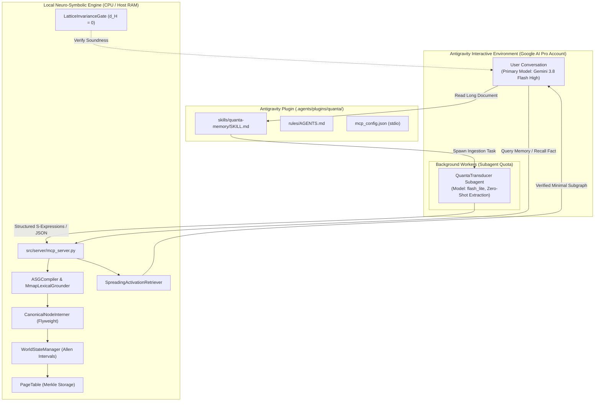

# Implementation Plan: Native Google AI Pro Antigravity Plugin for QUANTA

## Goal Description
Build an **Antigravity Plugin** (`.agents/plugins/quanta/`) that integrates QUANTA's neuro-symbolic memory directly into Antigravity using your **existing Google AI Pro subscription (email-based authentication)**. 

### The Problem with External API Keys
- Google AI Studio API keys are restricted to the severely rate-limited Free Tier (15 RPM) unless credit-card pay-as-you-go Cloud Billing is enabled.
- You are **already paying for a Google AI Pro subscription**, which provides full quota for frontier models (Gemini Pro, Flash, Flash-Lite) inside Antigravity through your signed-in Google account.
- **Solution**: Decouple the model tiers **natively inside Antigravity**. Ingestion and syntax parsing are routed to Antigravity's built-in **`flash_lite` subagent model tier** (minimal quota, near-instant, zero thinking tokens), while your primary chat session remains on your preferred high-reasoning model (**Gemini 3.8 Flash High**). No API keys, no separate billing, and no local GPU VRAM consumed.

---

## User Review Required

> [!IMPORTANT]
> **Zero External Billing & Zero API Keys**:
> - The entire solution runs inside Antigravity's authenticated runtime environment.
> - No `GEMINI_API_KEY`, no Google Cloud billing account, and no credit card charges are required.
> - All model calls utilize your existing Google AI Pro subscription quota.

> [!TIP]
> **Subagent Model Tiering in Antigravity**:
> - Antigravity natively supports model selection per subagent: `Model: "flash_lite"`, `"flash"`, `"pro"`, or `"inherit"`.
> - By defining a specialized subagent (`QuantaTransducer`) with `Model: "flash_lite"`, high-volume text parsing is offloaded to the cheapest available Flash model.
> - This protects your high-tier conversational quota while delivering vastly higher grammatical accuracy and speed than any local 4B SLM.

---

## Architecture: Native Inversion-of-Control

Instead of having a standalone Python script attempt to reach an external API, **Antigravity acts as the orchestrator**:



---

## Proposed Changes

### Component: Antigravity Plugin Package (`.agents/plugins/quanta/`)

#### [NEW] `.agents/plugins/quanta/plugin.json`
Declares the native plugin:
```json
{
  "name": "quanta-memory",
  "version": "1.0.0",
  "description": "Native neuro-symbolic context expansion and long-term memory for Google Antigravity"
}
```

#### [NEW] `.agents/plugins/quanta/mcp_config.json`
Configures local stdio MCP server without any API keys or network dependencies:
```json
{
  "mcpServers": {
    "quanta-memory": {
      "command": "python",
      "args": ["${workspaceFolder}/src/server/mcp_server.py"],
      "env": {
        "QUANTA_ALLOW_CPU_OFFLOAD": "1",
        "QUANTA_TRANSDUCER_BACKEND": "mock"
      }
    }
  }
}
```

#### [NEW] `.agents/plugins/quanta/skills/quanta-memory/SKILL.md`
Instruction skill teaching Antigravity how to coordinate between the primary conversational model and the `flash_lite` worker:
1. **When Ingesting Large Text**:
   - The primary agent invokes a subagent with `Model: "flash_lite"` and the role `"QUANTA S-Expression Transducer"`.
   - The subagent extracts entities, relations, and temporal intervals into structured JSON.
   - The subagent calls the local MCP tool `quanta_ingest_propositions(doc_id, extracted_data)` to compile and persist the graph.
2. **When Querying Long-Term Memory**:
   - The primary agent calls `quanta_query_memory(query)` directly via MCP.
   - The local engine returns the verified, minimal subgraph in $< 5\text{ ms}$.
   - The primary agent incorporates the factual sub-graph into its response to the user.
3. **When Correcting a False Belief**:
   - Calls `quanta_revise_belief(entity, property, new_value, reason)` to update temporal intervals $[t_{\text{start}}, t_{\text{end}})$ without destroying history.

#### [NEW] `.agents/plugins/quanta/rules/AGENTS.md`
Contextual rules:
- Directs agents to never burn primary conversational quota on raw parsing; always delegate batch extraction to `flash_lite`.
- Requires factual verification via QUANTA before answering historical or domain-specific questions.

---

### Component: QUANTA Server Enhancements (`src/server/`)

#### [MODIFY] [`src/server/mcp_server.py`](file:///c:/Users/PC/Documents/GitHub/Quanta/src/server/mcp_server.py)
Add direct structured ingestion and belief revision tools to avoid needing an internal LLM in the Python process:
1. **`quanta_ingest_propositions(doc_id: str, propositions_json: str)`**:
   - Accepts pre-transduced JSON from Antigravity's `flash_lite` subagent.
   - Directly compiles nodes into 1024-D QuantaVectors, performs Flyweight interning, grounds via `MmapLexicalGrounder`, and inserts into `PageTable`.
   - Bypasses any local SLM or external network call entirely.
2. **`quanta_revise_belief(entity_cid_or_name: str, property_name: str, new_value: str, reason: str = "")`**:
   - Invokes [`WorldStateManager.assert_state`](file:///c:/Users/PC/Documents/GitHub/Quanta/src/memory/world_state.py#L418) to close the prior active interval and assert the updated state with `TEMP_ALLEN_FINISHES`.
3. **`quanta_verify_claim(claim_text: str)`**:
   - Calls [`LatticeInvarianceGate`](file:///c:/Users/PC/Documents/GitHub/Quanta/src/verification/lattice_gate.py) to check if a proposed claim creates an epistemic contradiction ($d_H > 0$ or $1 \sqcap 2 = 3$) with stored knowledge.

---

## Verification Plan

### Automated Tests
```powershell
# 1. Test MCP server structured proposition ingestion tool
pytest tests/test_context_expansion_server.py -v

# 2. Test belief revision and verification tools
pytest tests/test_world_state_tracking.py tests/test_lattice_meet_invariance.py -v

# 3. Test full pipeline with mock transduction input
pytest tests/test_cognitive_pipeline.py -v
```

### Manual Verification
1. Open a new Antigravity session with the plugin enabled.
2. Verify that `quanta-memory` is listed under active MCP servers without requiring any API keys.
3. Prompt: *"Ingest the background story of Chapter 1 using a flash_lite subagent."*
4. Confirm:
   - The subagent spawns with model `flash_lite` and completes extraction.
   - The propositions are stored into QUANTA's local SQLite / PageTable database.
   - Your primary chat model remains `Gemini 3.8 Flash High`.
   - Your GPU VRAM remains at $0\text{ MB}$.
