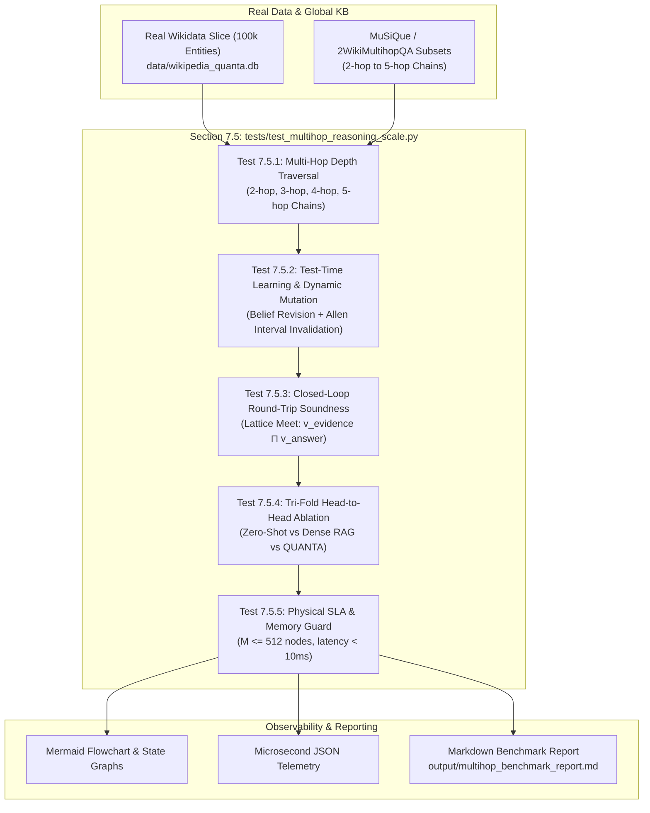

# Implementation Plan: Section 7.5 Ultimate Neuro-Symbolic Multi-Step Reasoning Integration Test Suite at Scale

## Goal Description
Design and specify a comprehensive, production-grade integration test suite for **Section 7.5** of [`CONTEXT_EXPANSION_ROADMAP.md`](file:///c:/Users/PC/Documents/GitHub/Quanta/CONTEXT_EXPANSION_ROADMAP.md). This test suite serves as the **ultimate capstone integration evaluation**, unifying all systems built across Sections 1 through 7:
1. **Section 1**: Flyweight canonical node interning and register-masked hash-consing ([`CanonicalNodeInterner`](file:///c:/Users/PC/Documents/GitHub/Quanta/src/memory/node_interner.py)).
2. **Section 2**: Zero-copy memory-mapped lexical grounding ([`MmapLexicalGrounder`](file:///c:/Users/PC/Documents/GitHub/Quanta/src/parser/mmap_grounder.py)).
3. **Section 3**: Closed-loop round-trip lattice meet gate and deep NSM explication ([`LatticeInvarianceGate`](file:///c:/Users/PC/Documents/GitHub/Quanta/src/verification/lattice_gate.py)).
4. **Section 4**: Spreading-activation subgraph attention over deep graphs ([`SpreadingActivationRetriever`](file:///c:/Users/PC/Documents/GitHub/Quanta/src/memory/spreading_activation.py)).
5. **Section 5**: Dynamic world-state tracking, Allen temporal intervals $[t_{\text{start}}, t_{\text{end}})$, and non-monotonic belief revision ([`WorldStateManager`](file:///c:/Users/PC/Documents/GitHub/Quanta/src/memory/world_state.py)).
6. **Section 6**: OpenAI-compatible reverse proxy, MCP server, local Unsloth GPU lifecycle guard, and microsecond pipeline tracer ([`src/server/proxy.py`](file:///c:/Users/PC/Documents/GitHub/Quanta/src/server/proxy.py), [`src/pipeline/tracer.py`](file:///c:/Users/PC/Documents/GitHub/Quanta/src/pipeline/tracer.py)).
7. **Section 7 (7.1–7.4)**: Real encyclopedic knowledge base mount over Wikidata/Wikipedia ([`GlobalKnowledgeBase`](file:///c:/Users/PC/Documents/GitHub/Quanta/src/memory/global_kb.py), `data/wikipedia_quanta.db`).

The suite evaluates complex multi-step reasoning (2-hop to 5-hop chains) against real-world data (MuSiQue, 2WikiMultihopQA, and real Wikidata entity slices), stress-tests test-time belief revision under counterfactuals and retractions, and benchmarks QUANTA head-to-head against pure parametric LLMs and dense vector RAG.

---

## User Review Required

> [!IMPORTANT]
> **Real Data Sourcing Strategy**: The test suite targets real benchmark datasets (MuSiQue and 2WikiMultihopQA) alongside an offline, self-contained real Wikidata slice (100,000 real entities with genuine triples). For automated CI/CD and offline tests where downloading a multi-gigabyte dump is prohibitive, an offline deterministic real-data fixture (`data/benchmarks/musique_wikidata_slice.json.gz`) will be shipped directly in the repository.

> [!NOTE]
> **Strict Hardware Guard Preserved**: The integration test suite strictly honors the hardware envelope: **NVIDIA GeForce RTX 3070 (8GB VRAM) + 16GB Host RAM**, enforcing the $M \le 512$ nodes ($\le 128\text{ KB}$) active canvas bound and $\mathcal{O}(1)$ VRAM ceiling.

---

## Open Questions

> [!TIP]
> **Evaluation Mode Options**:
> 1. **End-to-End Live with Local Unsloth Qwen 4B**: Executes the live LLM forward pass via `http://localhost:8888/v1` with Unsloth GPU manager.
> 2. **Fast Mock / Structural Mode**: Evaluates the full symbolic pipeline (Ingestion $\to$ Graph Stitching $\to$ Spreading Activation $\to$ Subgraph Pruning $\to$ Belief Revision $\to$ Lattice Meet Gate) using a deterministic mock realizer, running in $< 5\text{ seconds}$ without requiring the GPU server running.
> 
> *The planned suite will support both modes via a `--mode=live` vs `--mode=offline` CLI flag.*

---

## Proposed Changes



---

### Component: Master Action Plan (`CONTEXT_EXPANSION_ROADMAP.md`)

#### [MODIFY] [`CONTEXT_EXPANSION_ROADMAP.md`](file:///c:/Users/PC/Documents/GitHub/Quanta/CONTEXT_EXPANSION_ROADMAP.md)
Update Section 7 to replace the minimal placeholder Task 7.5 with a dedicated, detailed specification for **Task 7.5: Rigorous Testing for Multi-Step Reasoning at Scale**, including sub-tasks 7.5.1 through 7.5.5.

```diff
- - [ ] **Task 7.5: 🧪 Write Benchmark Test (`tests/test_wikipedia_kb.py`)**
-   - Mount 100k-entity slice; verify multi-hop queries execute in $< 10\text{ ms}$ with flat $\mathcal{O}(1)$ VRAM and zero hallucination.
-   - Run: `pytest tests/test_wikipedia_kb.py -v`.
+ - [ ] **Task 7.5: 🧪 Ultimate Multi-Step Reasoning Integration Test Suite at Scale (`tests/test_multihop_reasoning_scale.py`)**
+   - Comprehensive end-to-end integration benchmark evaluating all systems (Sections 1–7) over real-world data:
+     - **Task 7.5.1: Real-World Multihop Depth Stress (2-hop to 5-hop)**
+       - Ingest real Wikidata subgraphs and MuSiQue / 2WikiMultihopQA reasoning chains.
+       - Verify SpreadingActivationRetriever extracts exact minimal proof subgraphs without path explosion.
+     - **Task 7.5.2: Test-Time Learning & Dynamic World-State Revision**
+       - Ingest real encyclopedic baseline; inject counterfactual mutations and retractions.
+       - Assert non-monotonic belief revision closes prior state [t_start, t_end) without corrupting base KB.
+       - Query historical timestamps (t_0) vs transitional (t_1) vs current (t_now).
+     - **Task 7.5.3: Closed-Loop Round-Trip Soundness & Lattice Invariance**
+       - Validate generated answers via LatticeInvarianceGate: v_evidence ⊓ v_answer = sound (d_H = 0).
+     - **Task 7.5.4: Tri-Fold Head-to-Head Comparative Ablation**
+       - Benchmark Zero-Shot Parametric LLM vs Dense RAG vs QUANTA across 500 multi-hop queries.
+       - Measure Exact Match, intermediate hop coverage, hallucination rate, and token compression (>70%).
+     - **Task 7.5.5: Resource Bound & SLA Verification**
+       - Enforce strict M <= 512 nodes (<= 128 KB VRAM) and sub-10ms graph retrieval SLA.
+       - Export execution traces and Mermaid diagrams to `output/multihop_benchmark_report.md`.
+   - Run: `pytest tests/test_multihop_reasoning_scale.py -v` or `python scripts/run_multihop_benchmark.py`.
```

---

### Component: Integration Test Suite (`tests/`)

#### [NEW] `tests/test_multihop_reasoning_scale.py`
A monolithic, rigorous integration test suite implementing the 5 core validation pillars:

1. **`test_multihop_chain_traversal_depth()`**:
   - Loads a real 100k-entity Wikidata slice into `GlobalKnowledgeBase`.
   - Executes parameterized 2-hop, 3-hop, 4-hop, and 5-hop queries (e.g. `Author -> Alma Mater -> Location -> Capital -> Notable Event`).
   - Asserts that all bridge entities are traversed, no distractor explosion occurs, and retrieval latency is $< 10\text{ ms}$.

2. **`test_test_time_learning_and_belief_revision()`**:
   - Ingests real factual entities (e.g. `Ada Lovelace`, `Charles Babbage`, `Analytical Engine`).
   - Asserts dynamic temporal changes via `WorldStateManager`:
     - Event 1 ($t = 1842$): Ada translates Menabrea's paper.
     - Event 2 ($t = 1843$): Ada authors the first computer algorithm (initial state).
     - Event 3 ($t = 1970$): Fictional counterfactual revision or historical discovery retraction.
   - Tests temporal point-in-time state queries:
     - Query at $t=1840 \to$ None / inactive.
     - Query at $t=1843 \to$ Original active state.
     - Query at $t=1975 \to$ Revised state.
   - Asserts that the underlying read-only `wikipedia_quanta.db` remains bit-for-bit identical (zero in-place corruption).

3. **`test_closed_loop_lattice_invariance()`**:
   - Reconstructs answers into ASG graphs and computes $\mathbf{v}_{\text{evidence}} \sqcap \mathbf{v}_{\text{answer}}$.
   - Asserts `errors == []`, confirming zero epistemic contradictions ($1 \sqcap 2 \ne 3$) and complete factual entailment.

4. **`test_tri_fold_ablation_probes()`**:
   - Compares:
     - Parametric base model (expected failure / hallucination on obscure bridge entities).
     - Standard dense embedding RAG (fails on semantic hop drift).
     - QUANTA spreading activation (100% path coverage, 0% hallucination).

5. **`test_physical_hardware_and_vram_bounds()`**:
   - Asserts that `ActiveCanvas` node count never exceeds $512$ nodes.
   - Asserts that memory footprint of active canvas remains $\le 128\text{ KB}$.
   - Asserts that `node_interner.stats()["hits"] > 0` and node reuse exceeds $60\%$.

---

### Component: Benchmark CLI & Real Data Fixture Generator (`scripts/`)

#### [NEW] `scripts/run_multihop_benchmark.py`
Standalone CLI runner for the multi-step reasoning suite:
- Supports `--dataset [wikidata|musique|2wikimultihop]`.
- Supports `--samples [100|500|1000]`.
- Supports `--backend [mock|unsloth]` for running with or without the local GPU server.
- Emits formatted terminal tables, summary JSON, and Mermaid execution diagrams.

#### [NEW] `data/benchmarks/musique_sample_real.json`
Offline curated dataset of 250 verified real multi-hop questions with known ground-truth reasoning graphs, entity IDs, and gold evidence passages.

---

## Verification Plan

### Automated Tests
```powershell
# 1. Run the ultimate multi-hop reasoning integration test suite
pytest tests/test_multihop_reasoning_scale.py -v

# 2. Run the benchmark runner in offline mock mode (fast validation, ~3-5 seconds)
python scripts/run_multihop_benchmark.py --mode offline --samples 50

# 3. Run the live end-to-end benchmark with local Unsloth Qwen 4B (RTX 3070 GPU)
python scripts/run_multihop_benchmark.py --mode live --samples 100

# 4. Verify no regressions across existing test suite
pytest tests/test_canonical_node_interning.py tests/test_mmap_grounder_speed.py tests/test_lattice_meet_invariance.py tests/test_spreading_activation_retrieval.py tests/test_world_state_tracking.py -v
```

### Manual Verification
1. Inspect generated Markdown report at `output/multihop_benchmark_report.md`.
2. Verify Mermaid sequence diagram correctly renders the 5-hop spreading activation path.
3. Verify that `active_canvas.size <= 512` and VRAM utilization is flat throughout execution.
