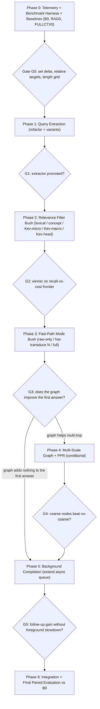

# Dynamic Multi-Scale Ingestion — Experiment-Driven Master Plan (`multi_scale_plan.md`)

> **Revision 2.** Replaces the original 8-section linear plan (commit `bcfb3e2`). Why it changed:
> - The original assumed that "3-pass Kev on every chunk" is the bottleneck. Since exp-025a the production default is `kev_mode="co_decoded"`, which makes **zero** secondary Kev calls. The real cost is skeleton transduction: about 1.2–1.4 s/chunk and about 108 words/s with 16 slots, measured on the RTX 3070.
> - Its latency, accuracy and threshold numbers were estimates, not measurements.
> - Parts of it duplicated existing code: `decompose_query_context` in `src/server/proxy.py` and `AsyncKevVerificationQueue` in `src/models/kev_async_worker.py`.
> - It rewired a method that does not exist (`ingest_and_query_streaming`).

---

## 0. Core Principles

1. **Measure before optimizing.** Phase 0 measures the current pipeline (baseline **B0**) before any feature work starts. Every later target is a value **relative to B0**.
2. **No hardcoded numbers.** Every threshold, weight, block size, budget and SLA is a **calibrated parameter** (see §1). When it has not been calibrated yet, its default is *pass-through*: the feature is off and behaviour matches B0 exactly. Nothing is invented.
3. **Each number has a source experiment.** A calibrated value is stored together with the experiment ID and commit SHA that produced it. If a value has no source experiment, it is not used.
4. **Stacked bushes, not a noodle** (AGENTS.md). Each phase runs a small group of 2–4 competing variants, compares them on held-out data, and promotes one winner at a **decision gate**. A gate can also decide to **stop** a line of work.
5. **Reuse before rebuilding.** Extend the existing proxy query parser, the async Kev queue, the HippoRAG/PoP-RAG modules and `PipelineExecutionTracer` instead of writing parallel copies.
6. **Calibrate and test on separate data.** Thresholds are fitted on a **dev** split. Verdicts are reported on a **test** split that is never used for fitting.

---

## 1. Calibrated Parameter Registry (cross-cutting, built in Phase 0)

#### [NEW] `src/config/multi_scale_config.py`
- `CalibratedParam` dataclass with these fields:
  - `name`
  - `value`
  - `default_passthrough`
  - `source_exp: Optional[str]`
  - `source_commit: Optional[str]`
  - `calibrated_on: Optional[str]` (dataset/split)
  - `notes`
- `MultiScaleConfig`, which loads in this order:
  1. built-in pass-through defaults
  2. `config/multi_scale_profile.json`, written only by the calibration scripts
  3. environment variables (`QUANTA_MS_<PARAM>`)
  4. per-request proxy headers
- `MultiScaleConfig.provenance_report()` outputs a Markdown table of every parameter and where its value came from. That table goes into every EVAL.md entry.
- Calibration scripts write the profile via `MultiScaleConfig.write_calibrated(name, value, source_exp, ...)`. Humans don't edit the JSON by hand.

#### [NEW] `tests/test_multi_scale_config.py`
- With no profile loaded, every feature flag resolves to pass-through.
- Loading follows the precedence order above.
- A profile entry with no `source_exp` is rejected.

**Parameters that will live in the registry** (none has a value yet):

| Parameter | Phase that calibrates it |
|---|---|
| `query_extractor.strategy` | 1 |
| `chunker.macro_target_tokens`, `chunker.micro_target_words` | 2 |
| `filter.strategy`, `filter.unit` (micro / macro / macro-head) | 2 |
| `filter.keep_threshold` / `filter.keep_top_k` / `filter.keep_budget_tokens` | 2 |
| `filter.calibration` (temperature / Platt coefficients) | 2 |
| `fast_path.mode` (raw-only / hot-transduce / full) | 3 |
| `fast_path.hot_transduce_n` | 3 |
| `fast_path.coverage_threshold` | 3 |
| `ppr.inter_scale_weight`, `poprag.coarse_node_weight` | 4 |
| `background.enabled`, `background.pause_policy`, `background.max_concurrency` | 5 |
| `targets.*` (latency/accuracy SLAs used by tests) | Gate G0 |

---

## 2. Metric Definitions (fixed before any run)

All metrics come from one harness so every phase compares like with like.

| Metric | Definition |
|---|---|
| **TTFT** | Time from proxy request receipt to the first streamed token from the reader backend |
| **TTC** | Time-to-context: request receipt until the reader prompt is fully assembled (excludes reader generation) |
| **E2E** | Request receipt to the last answer token |
| **Full-ingest time** | Wall-clock time to fully ingest the document (synchronous + background) |
| **Throughput** | Ingested words per second |
| **GPU calls / request** | Number of llama-server HTTP calls, broken down by stage |
| **Gold recall@budget** | Fraction of gold supporting passages (MuSiQue) or needle spans (NIAH) kept by the filter under a given token budget |
| **Answer accuracy** | EM / token-F1 (MuSiQue), needle hit rate (NIAH), task accuracy (BABILong) |
| **Peak VRAM** | Maximum `nvidia-smi` memory use during the run |

**Statistics:**
- Report every metric as mean ± 95% bootstrap CI.
- Compare variants **paired** (same samples, same seeds).
- **Non-inferiority** in accuracy means the CI of (variant − B0) lies entirely above −δ. **δ** is the non-inferiority margin, chosen at Gate G0 (see §Phase 0).

---

## 3. Phase & Gate Overview



Experiment IDs continue from the last recorded node: `exp-026*` (Phase 0) through `exp-031*` (Phase 6). Every node is created with `.\orx.ps1 create-experiment` or `git worktree add ..\exp-<name> -b exp/<name>`, and recorded in [EVAL.md](EVAL.md) together with the `provenance_report()` output.

---

## Phase 0 — Measurement Harness & Baselines (`exp-026*`)

**Goal:** know how the current system actually performs on long contexts before changing it.

### 0.1 Stage-level telemetry
#### [MODIFY] `src/pipeline/cognitive_pipeline.py`, `src/server/proxy.py`
- Use the existing `PipelineExecutionTracer` to emit per-stage timings for:
  - query split
  - chunking
  - transduction
  - Kev
  - Clingo-DL
  - PPR
  - context assembly
  - reader first token
  - reader end
- Count GPU calls per stage.
- Expose the totals in response headers so the harness can read them without parsing logs:
  - `X-Quanta-TTC-Ms`
  - `X-Quanta-Stage-Timings` (JSON)
  - `X-Quanta-GPU-Calls`
- TTFT is measured **client-side** by the harness (first SSE chunk), not inside the proxy.

### 0.2 Long-context benchmark builder
#### [NEW] `scripts/build_long_context_bench.py`
- **MuSiQue-long:** take items from `data/benchmarks/musique_sample_real.json`. Pad them with distractor paragraphs from other items until they reach each target length in the **length grid**. Record the gold paragraph positions.
- **NIAH:** a synthetic needle placed at configurable depths across the length grid. Needle depth is a recorded variable, so recall can be analyzed by position.
- **BABILong:** reuse the `babilong` suite from `src/benchmarks/paired_evaluator.py` if it can be generated at the required lengths. Otherwise generate it the same way as NIAH.
- Write deterministic dev/test splits (seeded) to `data/benchmarks/long_context/{dev,test}.jsonl`.
- The length grid and samples per cell are CLI arguments, chosen at Gate G0 after a pilot run. Start the pilot with a small grid. The defaults in the script describe the pilot only and carry no claim about the final run.

### 0.3 Baseline runner
#### [NEW] `scripts/run_baselines.py` (reuses `PairedEvaluator` HTTP plumbing)
Runs three reference conditions on the same samples:

| ID | Condition | Why it is needed |
|---|---|---|
| **B0** | Current production path (`co_decoded`, full synchronous ingestion → PPR → dual-stream context) | The baseline every target is relative to |
| **RAG0** | No transduction: lexical top-k raw passages → reader | Shows how much the graph adds over plain retrieval. If B0 ≈ RAG0, the multi-scale graph phases need justification. |
| **FULLCTX0** | Whole document sent straight to the reader (only where it fits the reader context) | Upper/lower reference for accuracy at short lengths |

- Runs B0 **twice** (two seeds, or the same seed twice) to measure **run-to-run noise**. That noise is the input for choosing δ.
- Output: `output/multi_scale/baseline_report.md` plus raw JSONL per sample.

#### [NEW] `tests/test_long_context_bench.py`
- Builder determinism (same seed gives the same files).
- Gold-position bookkeeping is correct.
- The harness runs end-to-end in mock mode (`transducer_backend="mock"`).

### Gate G0 — set the targets (user decision, recorded in EVAL.md)
Using the B0/RAG0/FULLCTX0 results:
1. **δ (accuracy non-inferiority margin):** chosen by the user, informed by B0's run-to-run noise CI. δ should not be smaller than that noise.
2. **Relative latency targets:** expressed as a fraction of B0 TTFT per length bucket, chosen from the measured B0 stage breakdown. For example, if transduction is X% of B0 TTFT, the best possible gain from skipping it is bounded by X%. Targets are written to the profile as `targets.*` with `source_exp = exp-026*`.
3. **Length grid and sample sizes** for the remaining phases, based on the pilot's variance and runtime.
4. **Go / no-go:** if RAG0 already matches B0 accuracy at far lower TTFT, re-scope Phases 3–4 with the user before continuing.

---

## Phase 1 — Query Extraction (`exp-027*`)

**Goal:** reliably isolate the question/instruction `q` from long prompts, as a single shared module.

#### [NEW] `src/parser/task_boundary_extractor.py`
- Move `decompose_query_context` and `extract_context_from_system` out of `src/server/proxy.py` into this module, unchanged. The proxy imports them from here, so the refactor itself changes no behaviour.
- `ExtractedTaskIntent` dataclass with these fields:
  - `query_text`
  - `context_text`
  - `boundary_location` (`HEAD` / `TAIL` / `SYSTEM` / `EXPLICIT` / `FALLBACK`)
  - `char_span`
  - `target_entities`
  - `strategy_used`
- `TaskBoundaryExtractor(strategy=config.query_extractor.strategy)`. Strategy variants:
  - **QE-A:** the existing heuristics, unchanged (control)
  - **QE-B:** QE-A plus head-directive detection ("You are…", "Your task…") and imperative/question-density scoring over head and tail windows. The window sizes are parameters.
  - **QE-C** (optional): structured chat-message awareness, i.e. prefer the last user message when the request has separate roles

#### [NEW] `scripts/evaluate_query_extractor.py`
- Labelled set: MuSiQue-long, NIAH, BABILong prompts (all with known questions), plus a small hand-made set of head-directive and mixed-format prompts.
- Metrics: exact query-span match, token-F1 versus the gold question, latency distribution.

#### [NEW] `tests/test_task_boundary_extractor.py`
- Refactor parity: QE-A output is identical to the old proxy functions on the existing proxy tests.
- Head, tail, system and explicit-delimiter cases.

**Gate G1:** promote the variant with the best span-F1 on test. Its latency is recorded, not required to meet a preset number. Write `query_extractor.strategy` to the profile.

---

## Phase 2 — Relevance Filter Bush (`exp-028*`) — the key experiment

**Goal:** find the cheapest way to discard irrelevant text **without losing gold evidence**, including evidence in the middle of a block.

### 2.1 Hierarchical chunker (shared by all variants)
#### [NEW] `src/parser/multi_scale_chunker.py`
- `MacroBlock` dataclass with these fields:
  - `macro_id`
  - `char_span`
  - `text`
  - `micro_chunks: List[DiscourseChunk]`
  - `concept_codes`
  - `surface_entities`
- `HierarchicalChunker(macro_target_tokens, micro_target_words)`. Both sizes come from the config. The micro level reuses `DiscourseChunker`.
- Concept profiling goes through the existing `MmapLexicalGrounder.resolve_concept_code`. Its cost is measured and reported, not assumed.

#### [MODIFY] `src/parser/chunker.py`
- Add `parent_macro_id: Optional[str] = None` to `DiscourseChunk`, and include it in `to_dict`/`from_dict`.

### 2.2 Filter variants
#### [NEW] `src/retrieval/relevance_filter.py`
A common interface: `score(intent, units) -> List[ScoredUnit]`, followed by a keep policy (threshold / top-k / token budget, all from the config).

| Variant | Unit | Scorer | GPU calls |
|---|---|---|---|
| **F-A** | micro | Lexical BM25 vs `q` | 0 |
| **F-B** | micro | Concept-code overlap via `MmapLexicalGrounder` | 0 |
| **F-C** | micro | Kev-4B single-token letter logprob (one prefill per micro-chunk, batched across slots) | n_micro |
| **F-D** | macro (full text) | Kev-4B letter logprob over the whole block | n_macro |
| **F-E** | macro (head only) | The original plan's design: concept keywords + first part of the block. Kept as a variant to test the mid-block-miss risk. | n_macro |
| **F-F** (only if justified) | cascade | Cheapest good scorer prefilters, then the best Kev scorer re-ranks | varies |

#### [MODIFY] `src/models/kev_engine.py`
- Add `score_relevance(intent, text) -> Dict[label, prob]` on top of the existing `/completion` + `n_probs` logprob path, reusing its letter normalization.
- The label set and prompt template are variant parameters, not constants.
- Raw logprobs are returned. Calibration is applied separately from the profile, so it can be re-fitted without code changes.

### 2.3 Calibration & evaluation
#### [NEW] `scripts/evaluate_relevance_filter.py`
For each variant on **dev**:
- Sweep the keep policy to trace a **gold-recall vs. kept-tokens vs. latency** curve.
- For logprob variants, fit calibration (temperature or Platt) and store the coefficients.
- Break recall down by **needle/gold depth within the block**, which directly tests the F-E concern.

Then re-measure the chosen operating points on **test**.

#### [NEW] `tests/test_relevance_filter.py`
- Keep-policy semantics (threshold / top-k / budget).
- Calibration round-trips through the profile.
- Logprob parsing on simulated `n_probs` responses.
- Pass-through mode keeps everything.

**Gate G2:** choose the operating point with the lowest cost (TTC/GPU calls) whose **downstream answer accuracy** is non-inferior to B0 within δ. Check this with a short downstream run, because recall alone is a proxy. Write the `filter.*` and `chunker.*` values to the profile with `source_exp`. If no variant reaches non-inferiority, **stop** and review with the user.

---

## Phase 3 — Fast-Path Mode Bush (`exp-029*`)

**Goal:** settle the main design question: should the first answer **wait for graph construction**, or answer from filtered raw text and build the graph afterwards?

#### [NEW] `src/memory/fast_path_assembler.py`
- `FastPathAssembler(mode, hot_transduce_n, coverage_threshold)`, all from the config.
- It reuses `DualStreamContextAssembler`. When the graph is empty, stream 1 (logical briefing) is simply omitted.
- `FastPathCoverageEvaluator.check_coverage(...)` returns a coverage score. The decision threshold is a calibrated parameter (pass-through means always take the full path).

| Variant | First-answer context | Synchronous transduction |
|---|---|---|
| **M-A raw-only** | Filtered raw spans only | none |
| **M-B hot-transduce(N)** | Graph briefing from the top-N filtered chunks + raw spans | N chunks (N swept) |
| **M-C full** | B0 behaviour applied to the filtered set | all kept chunks |
| **M-D coverage-adaptive** (if M-A/M-B differ by task type) | M-A when coverage ≥ threshold, else M-B | adaptive |

#### [MODIFY] `src/pipeline/cognitive_pipeline.py`
- Add `answer_long_context(prompt, config) -> FastPathResult`, a new orchestration method built from existing parts:
  1. extractor
  2. chunker
  3. filter
  4. selective `ingest_document`
  5. PPR
  6. assembler
- `process_and_answer_single_query` and the proxy call it **only when** `config.fast_path.mode` is set. Otherwise the behaviour is unchanged.

#### [NEW] `scripts/evaluate_fast_path.py`
- Paired runs on test across the length grid. Output: a TTFT vs. accuracy **Pareto plot** per task family (MuSiQue multi-hop, NIAH retrieval, BABILong state tracking).

#### [NEW] `tests/test_fast_path_assembler.py`
- Each mode builds the expected context structure.
- Pass-through mode matches B0 output on mock fixtures.

**Gate G3:**
- Choose `fast_path.mode` (and `hot_transduce_n`) from the Pareto frontier, subject to non-inferiority within δ and the G0 relative latency targets. The default may differ per task family if the data supports it.
- Decide whether Phase 4 is needed: **only proceed** if graph-backed modes (M-B/M-C) beat M-A on multi-hop accuracy by more than the noise.

---

## Phase 4 — Multi-Scale Graph & PPR (`exp-030*`, conditional on G3)

**Goal:** test whether coarse (macro/unprocessed) passage nodes connected to the fine-grained graph improve multi-hop retrieval.

#### [MODIFY] `src/memory/passage_store.py`
- `PassageRecord` stays **immutable**. Add the new attributes as fields with defaults:
  - `granularity` (`MACRO` / `MICRO`)
  - `parent_macro_id`
  - `concept_codes`
- Ingestion status changes over time, so it goes in a separate mutable table `passage_ingestion_state(passage_id, status, updated_at)`, with statuses `COARSE_ONLY` / `PENDING` / `FULL`.
- Add a SQLite schema migration that also handles existing DBs.

#### [MODIFY] `src/core/asg.py`
- `QuantaGraph.add_concept_anchor(passage_id, concept_code)`.
- `QuantaNode` can reference both a micro passage and its parent macro passage.
- `upgrade_passage(passage_id, subgraph)` merges a newly transduced subgraph without invalidating existing edges.
- First check whether `BinaryNodeTable`'s 128-byte layout has room for a parent-passage reference. If it doesn't, keep the reference in the side table rather than changing the struct.

#### [MODIFY] `src/memory/hipporag_ppr.py`, `src/memory/poprag_gating.py`
- The inter-scale edge weight and the coarse-node damping weight are config parameters (pass-through means no coarse nodes, i.e. current behaviour).
- Combine them with the existing Belnap gating (`00₂` CONTRADICTION → 0) rather than replacing it.

| Variant | Description |
|---|---|
| **G-A** | No coarse nodes (G3 winner as-is; control) |
| **G-B** | Coarse nodes + concept anchors; `inter_scale_weight` / `coarse_node_weight` swept on dev |
| **G-C** (optional) | G-B with on-demand upgrade: PPR-activated coarse nodes are transduced before answering |

#### [NEW] `scripts/evaluate_multi_scale_ppr.py`
- Multi-hop accuracy on MuSiQue-long.
- PPR latency **as a function of graph size**, measured as a scaling curve rather than checked against a fixed SLA.

#### [NEW] `tests/test_multi_scale_asg.py`, `tests/test_multi_scale_hipporag.py`
- Mixed-graph construction.
- In-place upgrade keeps existing edges.
- Migration on a legacy DB.
- Pass-through PPR output equals current output.

**Gate G4:** promote G-B/G-C only if multi-hop accuracy improves beyond noise with acceptable TTC cost. Otherwise **stop** this branch and record the negative result.

---

## Phase 5 — Background Completion (`exp-031*`)

**Goal:** finish ingesting the deferred chunks while the system is idle, so later turns benefit, without slowing down foreground requests.

#### [MODIFY] `src/models/kev_async_worker.py`
- Generalize `AsyncKevVerificationQueue` into a queue that can run **transduction + Kev + Clingo-DL** for deferred chunks. Today it only does Kev verification, while transduction is the dominant cost.
- Keep the existing `prioritize` / `flush` / `clear` API and its tests.
- Priority = calibrated filter score from Phase 2.
- Pause policies (variants, chosen by config):
  - **BG-A:** none
  - **BG-B:** in-process foreground lock (the pipeline marks foreground calls)
  - **BG-C:** poll llama-server `/slots` and pause when the number of busy slots goes above a configured limit
- `QUANTA_BACKGROUND_INGESTION` (`0`/`off` default in tests/CI, `1`/`on`) stops the background worker entirely when off. Thread teardown is enforced in `CognitivePipeline.close()` and `reset()`.

#### [NEW] `scripts/evaluate_background_ingestion.py`
- **Multi-turn** protocol: turn 1 = long document + question; turns 2..k = follow-up questions on other parts of the document.
- Measures:
  - foreground TTFT degradation with background on vs. off
  - follow-up accuracy and latency
  - peak VRAM

#### [NEW] `tests/test_background_ingestor.py`
- Off-switch leaves no threads running.
- Items are processed in priority order.
- Pause/resume works under simulated foreground load.
- An upgrade lands in the graph and the passage-state table.

**Gate G5:** enable background completion by default only if follow-up accuracy or latency improves and foreground TTFT degradation stays within the G0 tolerance. Choose the pause policy from the measured contention.

---

## Phase 6 — Integration & Final Paired Evaluation (`exp-032*`)

#### [MODIFY] `src/server/proxy.py`
- Route long prompts through `CognitivePipeline.answer_long_context` when the profile enables it.
- Per-request override headers:
  - `X-Quanta-Fast-Path-Mode`
  - `X-Quanta-Background-Ingest`
  - `X-Quanta-Profile` (`calibrated` / `passthrough`)
- Telemetry headers:
  - `X-Quanta-TTC-Ms`
  - `X-Quanta-Stage-Timings`
  - `X-Quanta-Units-Scored`
  - `X-Quanta-Units-Kept`
  - `X-Quanta-Hot-Transduced`
  - `X-Quanta-Deferred`

#### [NEW] `scripts/evaluate_dynamic_ingestion.py`
- Final paired comparison on the **test** split: B0 vs. RAG0 vs. the promoted configuration, across the full G0 length grid and all three task families.
- Outputs `output/multi_scale/final_report.md` with:
  - relative TTFT/TTC/E2E versus B0 (with CIs)
  - accuracy deltas versus δ
  - GPU calls/request
  - peak VRAM
  - the full `provenance_report()`

#### [NEW] `tests/test_dynamic_ingestion_pipeline.py`
- Mock end-to-end run.
- Pass-through profile matches B0 output exactly.
- With the calibrated profile, the assertions read their targets from `targets.*` in the profile (no literal SLAs in test code). These tests are skipped when the profile is uncalibrated.

---

## Verification Commands (Windows PowerShell)

```powershell
# Always-on regression (mock, background ingestion disabled)
$env:QUANTA_BACKGROUND_INGESTION = "0"
pytest tests/ -v

# Phase 0
python scripts/build_long_context_bench.py --pilot
python scripts/run_baselines.py --split dev --conditions B0,RAG0,FULLCTX0 --repeat-b0 2

# Phase 1
pytest tests/test_task_boundary_extractor.py -v
python scripts/evaluate_query_extractor.py --split test

# Phase 2
pytest tests/test_multi_scale_chunker.py tests/test_relevance_filter.py -v
python scripts/evaluate_relevance_filter.py --split dev --variants F-A,F-B,F-C,F-D,F-E --calibrate
python scripts/evaluate_relevance_filter.py --split test --from-profile

# Phase 3
pytest tests/test_fast_path_assembler.py -v
python scripts/evaluate_fast_path.py --split test --modes M-A,M-B,M-C

# Phase 4 (only if G3 says go)
pytest tests/test_multi_scale_asg.py tests/test_multi_scale_hipporag.py -v
python scripts/evaluate_multi_scale_ppr.py --split dev --sweep

# Phase 5
pytest tests/test_background_ingestor.py -v
python scripts/evaluate_background_ingestion.py --split test --policies BG-A,BG-B,BG-C

# Phase 6
pytest tests/test_dynamic_ingestion_pipeline.py -v
python scripts/evaluate_dynamic_ingestion.py --split test --profile calibrated
```

Manual checks (live RTX 3070):
1. `nvidia-smi` during a foreground request with background ingestion on. Record the peak VRAM and compare it with B0.
2. With `QUANTA_BACKGROUND_INGESTION=0`, confirm that no worker threads remain after `pytest` finishes.

---

## Session Starter Commands

* `Start working on Phase 0 in @multi_scale_plan.md: Telemetry, Long-Context Benchmark Builder & Baselines`
* `Start working on Phase 1 in @multi_scale_plan.md: Query Extraction Refactor & Variants`
* `Start working on Phase 2 in @multi_scale_plan.md: Hierarchical Chunker & Relevance Filter Bush`
* `Start working on Phase 3 in @multi_scale_plan.md: Fast-Path Mode Bush`
* `Start working on Phase 4 in @multi_scale_plan.md: Multi-Scale Graph & PPR (only if Gate G3 = go)`
* `Start working on Phase 5 in @multi_scale_plan.md: Background Completion via Async Queue`
* `Start working on Phase 6 in @multi_scale_plan.md: Integration & Final Paired Evaluation`

Every session must:
- read the latest gate decision in EVAL.md before starting
- respect the AGENTS.md repair cap (at most 2 repair runs per node)
- record each answered node, including negative results, before moving on