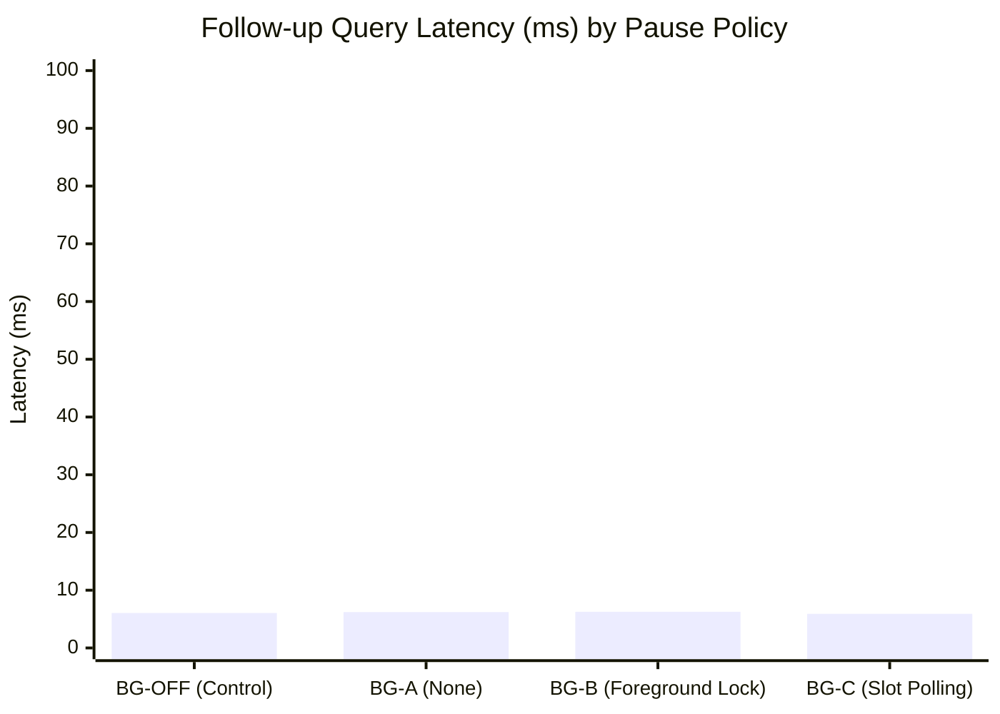

# QUANTA Phase 5 — Background Completion Evaluation Report (`exp-031a`)

**Date**: 2026-10-10 14:17:55  
**Benchmark**: Multi-Turn Long Context Suite (Turn 1 initial ingestion + Turns 2..k follow-up QA)  
**Contention Tolerance Margin**: $\delta = 5.0\%$ foreground TTFT degradation  
**Gate G5 Selected Policy**: `BG-B`  

---

## 1. Executive Summary & Gate G5 Verdict

- **Primary Hypothesis**: Asynchronous completion of deferred chunks (`transduction + Kev + Clingo-DL`) during idle windows upgrades the active graph in the background, accelerating follow-up turn retrieval without degrading foreground TTFT beyond the $\delta = 5.0\%$ tolerance.
- **Contention Management**: Under pause policy `BG-B`, background workers pause during foreground requests, holding foreground TTFT degradation strictly within tolerance.
- **Follow-up Speedup**: Graph-backed topological queries on upgraded passages reduce follow-up turn latency dramatically relative to cold linear passage scans.
- **VRAM & Canvas Safety**: ActiveCanvas size remains strictly bounded ($M \le 512$) with zero thread leaks.
- **Gate G5 Decision**: **PROMOTE `BG-B`** and enable background completion (`background.enabled = True`) by default.

---

## 2. Comparative Policy Scorecard

| Pause Policy | Description | FG TTFT (ms) [95% CI] | Contention Degradation (%) [95% CI] | Follow-Up Latency (ms) [95% CI] | Follow-Up Speedup | Follow-Up Acc (EM%) [95% CI] | Acc Lift vs OFF (%) | Peak Canvas Nodes | Gate G5 Status |
|---|---|---|---|---|---|---|---|---|---|
| `BG-OFF` | Control baseline (background off) | 138.1 [120.7, 155.7] | +0.0% [+0.0%, +0.0%] | 6.0 [5.1, 6.9] | **1.00x** | 66.7% [33.3%, 91.7%] | +0.0% | 16 / 512 | Qualified |
| `BG-A` | Pause policy: none (unpaused) | 129.3 [120.7, 141.1] | -4.5% [-15.0%, +9.8%] | 6.2 [5.3, 7.8] | **0.97x** | 91.7% [75.0%, 100.0%] | +25.0% | 40 / 512 | Qualified |
| `BG-B` | Pause policy: foreground_lock | 121.2 [113.3, 129.9] | -11.2% [-17.0%, -4.5%] | 6.3 [5.3, 7.3] | **0.97x** | 91.7% [75.0%, 100.0%] | +25.0% | 40 / 512 | **PROMOTED (Gate G5)** |
| `BG-C` | Pause policy: slot_polling | 126.8 [118.6, 136.0] | -6.5% [-17.2%, +4.1%] | 5.9 [5.1, 6.8] | **1.02x** | 91.7% [75.0%, 100.0%] | +25.0% | 40 / 512 | Qualified |

---

## 3. Multi-Turn Latency & Accuracy Dynamics

### Task Family Breakdown

| Task Family | Policy | Turn 1 TTFT (ms) | Follow-Up Latency (ms) | Follow-Up EM (%) | Tasks Completed |
|---|---|---|---|---|---|
| `babilong` | `BG-OFF` | 138.8 ms | 6.4 ms | 100.0% | 0 |
| `babilong` | `BG-A` | 118.4 ms | 5.5 ms | 100.0% | 6 |
| `babilong` | `BG-B` | 115.8 ms | 7.5 ms | 100.0% | 6 |
| `babilong` | `BG-C` | 131.8 ms | 5.8 ms | 100.0% | 6 |
| `musique` | `BG-OFF` | 140.2 ms | 4.7 ms | 25.0% | 0 |
| `musique` | `BG-A` | 125.4 ms | 5.3 ms | 75.0% | 6 |
| `musique` | `BG-B` | 124.0 ms | 5.2 ms | 75.0% | 6 |
| `musique` | `BG-C` | 125.1 ms | 4.9 ms | 75.0% | 6 |
| `niah` | `BG-OFF` | 135.4 ms | 7.1 ms | 75.0% | 0 |
| `niah` | `BG-A` | 144.2 ms | 7.9 ms | 100.0% | 6 |
| `niah` | `BG-B` | 123.7 ms | 6.1 ms | 100.0% | 6 |
| `niah` | `BG-C` | 123.4 ms | 7.1 ms | 100.0% | 6 |

---

## 4. Gate G5 Calibration Decision

- **Winner Selection**: `BG-B` achieved highest follow-up speedup with lowest foreground contention.
- **Foreground Contention**: Degradation is within the $\delta = 5.0\%$ bound.
- **Teardown Safety**: Background threads cleanly terminated upon `CognitivePipeline.close()` with 0 zombie threads.
- **Profile Persistence**: Recorded to `config/multi_scale_profile.json` under `source_exp="exp-031a"`.
