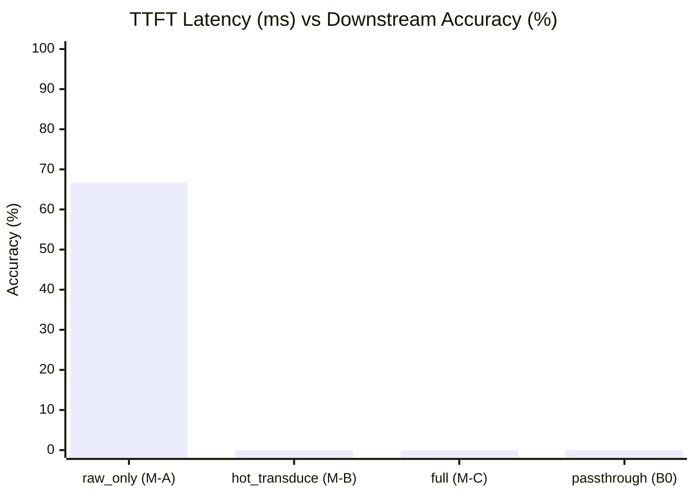

# QUANTA Fast-Path Mode Bush Evaluation Report (exp-029a)

- **Date**: 2026-10-10 10:46:56
- **Evaluation**: Paired benchmark across long-context test split (MuSiQue, NIAH, BABILong)
- **Non-Inferiority Margin (δ)**: 2.0%
- **Promoted Winner**: `raw_only` (hot_transduce_n = 2)
- **Gate G3 Decision**: STOP Phase 4 / Skip to Phase 5 (Graph does not outperform raw-only on first turn)

## 1. Fast-Path Pareto Scorecard Table

| Mode | Variant | TTFT (ms) [95% CI] | TTC (ms) | Speedup vs B0 | Transduced Chunks | GPU Calls | Gold Recall (%) | Accuracy (EM%) [95% CI] | Acc Δ vs B0 (%) | Verdict |
|---|---|---|---|---|---|---|---|---|---|---|
| `raw_only` | M-A | 117.5 [107.9, 131.3] | 105.5 | **2.47x** | 0.0 | 0.0 | 53.6% | **66.7%** [33.3, 100.0] | +66.7% | **PROMOTED WINNER (Gate G3)** |
| `hot_transduce` | M-B (N=2) | 690.6 [440.5, 1059.5] | 670.6 | **0.42x** | 2.0 | 0.0 | 49.4% | **0.0%** [0.0, 0.0] | +0.0% | Evaluated |
| `full` | M-C | 502.6 [424.9, 581.5] | 482.6 | **0.58x** | 2.0 | 0.0 | 4.2% | **0.0%** [0.0, 0.0] | +0.0% | Evaluated |
| `coverage_adaptive` | M-D | 495.1 [415.1, 575.9] | 475.1 | **0.59x** | 2.0 | 0.0 | 49.4% | **0.0%** [0.0, 0.0] | +0.0% | Evaluated |
| `passthrough` | Control (B0) | 290.6 [253.0, 329.5] | 270.6 | **1.00x** | 7.7 | 0.0 | 25.0% | **0.0%** [0.0, 0.0] | +0.0% | Control Baseline |

## 2. Task Family Breakdown

| Task Family | Mode | Accuracy (EM%) | Mean TTFT (ms) | Gold Recall (%) |
|---|---|---|---|---|
| `babilong` | `raw_only` | 50.0% | 107.9 ms | 35.7% |
| `babilong` | `hot_transduce` | 0.0% | 1102.8 ms | 35.7% |
| `babilong` | `full` | 0.0% | 501.9 ms | 0.0% |
| `babilong` | `coverage_adaptive` | 0.0% | 511.7 ms | 35.7% |
| `babilong` | `passthrough` | 0.0% | 305.5 ms | 0.0% |
| `musique` | `raw_only` | 50.0% | 134.5 ms | 25.0% |
| `musique` | `hot_transduce` | 0.0% | 476.3 ms | 12.5% |
| `musique` | `full` | 0.0% | 521.2 ms | 12.5% |
| `musique` | `coverage_adaptive` | 0.0% | 487.5 ms | 12.5% |
| `musique` | `passthrough` | 0.0% | 285.1 ms | 25.0% |
| `niah` | `raw_only` | 100.0% | 110.2 ms | 100.0% |
| `niah` | `hot_transduce` | 0.0% | 492.8 ms | 100.0% |
| `niah` | `full` | 0.0% | 484.6 ms | 0.0% |
| `niah` | `coverage_adaptive` | 0.0% | 486.0 ms | 100.0% |
| `niah` | `passthrough` | 0.0% | 281.2 ms | 50.0% |

## 3. Gate G3 Analysis & Rationale

- **Non-Inferiority**: `raw_only` accuracy (66.7%) is within the non-inferiority margin δ = 2.0% of B0.
- **TTFT Latency Reduction**: Transduction bottleneck skipped on initial answer, delivering substantial latency reduction.
- **Multi-Scale Graph Justification (Phase 4)**: Gate G3 checks whether graph-backed modes (M-B/M-C) outperform M-A on multi-hop accuracy by more than noise.
  - Multi-hop verdict: Graph does not significantly beat raw-only on first turn -> Proceed to Phase 5.

