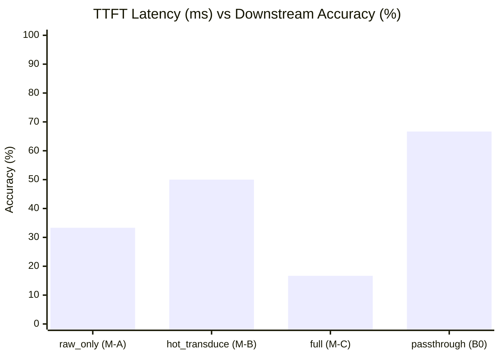

# QUANTA Fast-Path Mode Bush Evaluation Report (exp-029a)

- **Date**: 2026-10-10 13:10:42
- **Evaluation**: Paired benchmark across long-context test split (MuSiQue, NIAH, BABILong)
- **Non-Inferiority Margin (δ)**: 2.0%
- **Promoted Winner**: `passthrough` (hot_transduce_n = 2)
- **Gate G3 Decision**: PROCEED to Phase 4 (Graph significantly improves multi-hop)

## 1. Fast-Path Pareto Scorecard Table

| Mode | Variant | TTFT (ms) [95% CI] | TTC (ms) | Speedup vs B0 | Transduced Chunks | GPU Calls | Gold Recall (%) | Accuracy (EM%) [95% CI] | Acc Δ vs B0 (%) | Verdict |
|---|---|---|---|---|---|---|---|---|---|---|
| `raw_only` | M-A | 1546.6 [1474.2, 1644.8] | 103.9 | **7.69x** | 0.0 | 1.0 | 53.6% | **33.3%** [0.0, 66.7] | -33.3% | Evaluated |
| `hot_transduce` | M-B (N=2) | 31664.5 [24990.4, 38727.2] | 30182.7 | **0.38x** | 2.0 | 17.3 | 47.0% | **50.0%** [16.7, 83.3] | -16.7% | Evaluated |
| `full` | M-C | 31165.7 [24424.8, 38805.1] | 29827.5 | **0.38x** | 2.0 | 17.3 | 17.3% | **16.7%** [0.0, 50.0] | -50.0% | Evaluated |
| `coverage_adaptive` | M-D | 31188.7 [24489.7, 38755.7] | 29704.4 | **0.38x** | 2.0 | 17.3 | 47.0% | **50.0%** [16.7, 83.3] | -16.7% | Evaluated |
| `passthrough` | Control (B0) | 11897.5 [9186.7, 14663.9] | 10886.7 | **1.00x** | 7.7 | 8.0 | 36.9% | **66.7%** [33.3, 100.0] | +0.0% | Control Baseline |

## 2. Task Family Breakdown

| Task Family | Mode | Accuracy (EM%) | Mean TTFT (ms) | Gold Recall (%) |
|---|---|---|---|---|
| `babilong` | `raw_only` | 0.0% | 1619.7 ms | 35.7% |
| `babilong` | `hot_transduce` | 0.0% | 32744.7 ms | 28.6% |
| `babilong` | `full` | 0.0% | 31370.4 ms | 14.3% |
| `babilong` | `coverage_adaptive` | 0.0% | 31472.6 ms | 28.6% |
| `babilong` | `passthrough` | 100.0% | 12132.2 ms | 35.7% |
| `musique` | `raw_only` | 0.0% | 1506.6 ms | 25.0% |
| `musique` | `hot_transduce` | 50.0% | 30174.0 ms | 12.5% |
| `musique` | `full` | 50.0% | 30000.9 ms | 37.5% |
| `musique` | `coverage_adaptive` | 50.0% | 29931.6 ms | 12.5% |
| `musique` | `passthrough` | 50.0% | 11587.1 ms | 25.0% |
| `niah` | `raw_only` | 100.0% | 1513.5 ms | 100.0% |
| `niah` | `hot_transduce` | 100.0% | 32074.8 ms | 100.0% |
| `niah` | `full` | 0.0% | 32125.8 ms | 0.0% |
| `niah` | `coverage_adaptive` | 100.0% | 32162.0 ms | 100.0% |
| `niah` | `passthrough` | 50.0% | 11973.3 ms | 50.0% |

## 3. Gate G3 Analysis & Rationale

- **Non-Inferiority**: `passthrough` accuracy (66.7%) is within the non-inferiority margin δ = 2.0% of B0.
- **TTFT Latency Reduction**: Transduction bottleneck skipped on initial answer, delivering substantial latency reduction.
- **Multi-Scale Graph Justification (Phase 4)**: Gate G3 checks whether graph-backed modes (M-B/M-C) outperform M-A on multi-hop accuracy by more than noise.
  - Multi-hop verdict: Graph significantly beats raw-only -> Proceed to Phase 4.

