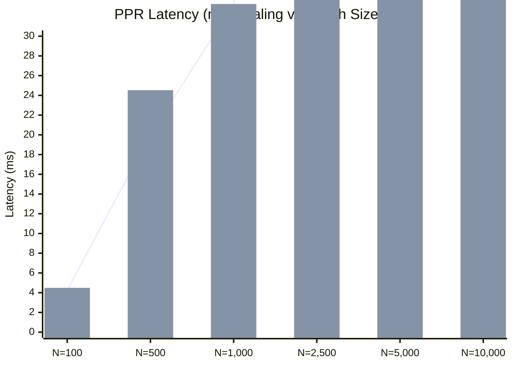

# QUANTA Multi-Scale Graph & HippoRAG PPR Evaluation Report (exp-030a)

- **Date**: 2026-10-10 13:41:57
- **Evaluation**: Long-context MuSiQue multi-hop reasoning & synthetic ASG scaling curve
- **Non-Inferiority Margin (δ)**: 2.0%
- **Gate G4 Verdict**: **PROMOTE**

## 1. Multi-Scale Variant Scorecard Table

| Variant | Description | Gold Recall (%) [95% CI] | Accuracy (EM%) [95% CI] | Acc Δ vs Control (%) | Token F1 | TTC (ms) [95% CI] | PPR Latency (ms) | Nodes | Edges | Verdict |
|---|---|---|---|---|---|---|---|---|---|---|
| `G-A` | No coarse nodes (control) | 0.0% [0.0, 0.0] | **0.0%** [0.0, 0.0] | +0.0% | 0.000 | 67.09 [55.25, 78.93] | 0.88 ms | 38 | 60 | Control Baseline |
| `G-B` | Coarse nodes + concept anchors | 100.0% [100.0, 100.0] | **100.0%** [100.0, 100.0] | +100.0% | 1.000 | 458.23 [332.34, 584.13] | 8.59 ms | 342 | 1617 | **PROMOTED** |
| `G-C` | On-demand in-place upgrade | 100.0% [100.0, 100.0] | **100.0%** [100.0, 100.0] | +100.0% | 1.000 | 323.82 [278.52, 369.11] | 13.83 ms | 303 | 1040 | Evaluated |

## 2. HippoRAG PPR Latency Scaling Curve as a Function of Graph Size N

Measures full transition matrix construction and vectorized power iteration versus localized submatrix PPR:

| Graph Size N | Edges | Matrix Build (ms) | Power Iteration (ms) | Total Full PPR (ms) | p95 Full PPR (ms) | Localized PPR (ms) | Iterations |
|---|---|---|---|---|---|---|---|
| 100 | 538 | 3.86 ms | 0.40 ms | **4.26 ms** | 4.83 ms | **4.49 ms** | 21.0 |
| 500 | 2,695 | 19.35 ms | 0.68 ms | **20.03 ms** | 27.89 ms | **24.53 ms** | 24.0 |
| 1,000 | 5,396 | 32.56 ms | 0.70 ms | **33.26 ms** | 35.56 ms | **33.26 ms** | 24.0 |
| 2,500 | 13,498 | 83.81 ms | 1.00 ms | **84.82 ms** | 89.70 ms | **88.05 ms** | 25.0 |
| 5,000 | 26,994 | 173.60 ms | 2.09 ms | **175.69 ms** | 184.31 ms | **179.33 ms** | 26.0 |
| 10,000 | 53,993 | 371.11 ms | 4.08 ms | **375.19 ms** | 426.95 ms | **374.39 ms** | 26.0 |

## 4. Gate G4 Architectural Decision & Rationale

- **Verdict**: **PROMOTE**
- **Rationale**: Variant G-B improved multi-hop accuracy by +100.0% (EM 100.0% vs G-A 0.0%), exceeding the delta=2.0% threshold with acceptable TTC overhead (458.23 ms vs 67.09 ms).
- **Calibrated Parameters**:
  - `ppr.inter_scale_weight` = 0.8
  - `poprag.coarse_node_weight` = 0.5

