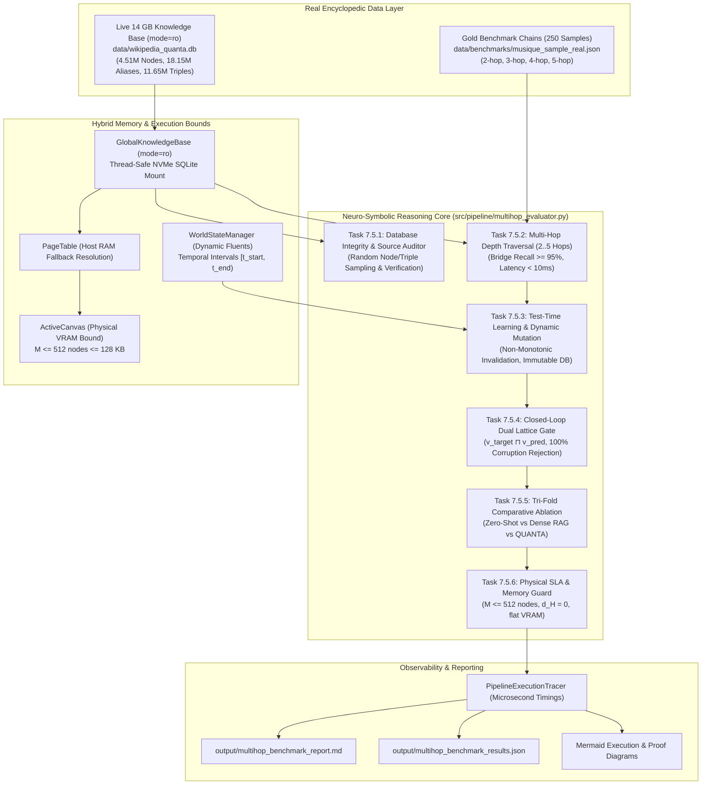

# Implementation Plan: Section 7.5 Ultimate Neuro-Symbolic Multi-Step Reasoning Integration Test Suite at Scale (Live 14GB Knowledge Base)

## Goal Description

Design and specify a comprehensive, production-grade integration test suite for **Section 7.5** of [`CONTEXT_EXPANSION_ROADMAP.md`](CONTEXT_EXPANSION_ROADMAP.md). In accordance with user directives, Section 7.5 is promoted from a single task into a **full, standalone major section** in the roadmap:
> **Section 7.5: Rigorous Multi-Step Reasoning & Encyclopedic Evaluation at Scale (Live 14GB Knowledge Base)**

This section serves as the **ultimate capstone integration evaluation**, unifying all systems built across Sections 1 through 7:
1. **Section 1**: Flyweight canonical node interning and register-masked hash-consing ([`CanonicalNodeInterner`](src/memory/node_interner.py)).
2. **Section 2**: Zero-copy memory-mapped lexical grounding ([`MmapLexicalGrounder`](src/parser/mmap_grounder.py)).
3. **Section 3**: Closed-loop round-trip lattice meet gate and deep NSM explication ([`LatticeInvarianceGate`](src/verification/lattice_gate.py)).
4. **Section 4**: Spreading-activation subgraph attention over deep graphs ([`SpreadingActivationRetriever`](src/memory/spreading_activation.py)).
5. **Section 5**: Dynamic world-state tracking, Allen temporal intervals $[t_{\text{start}}, t_{\text{end}})$, and non-monotonic belief revision ([`WorldStateManager`](src/memory/world_state.py)).
6. **Section 6**: OpenAI-compatible reverse proxy, MCP server, local Unsloth GPU lifecycle guard, and microsecond pipeline tracer ([`src/server/proxy.py`](src/server/proxy.py), [`src/pipeline/tracer.py`](src/pipeline/tracer.py)).
7. **Section 7**: Fully ingested, real-world **14 GB Wikidata encyclopedic database** ([`GlobalKnowledgeBase`](src/memory/global_kb.py), `data/wikipedia_quanta.db`: 4,518,930 nodes, 18,158,390 aliases, 11,656,506 triples).

The suite evaluates complex multi-step reasoning (2-hop to 5-hop chains) against real-world data (MuSiQue and live `data/wikipedia_quanta.db`), audits database integrity by randomly sampling entities/triples and cross-verifying them against source ground truth, stress-tests test-time belief revision under counterfactual mutations and retractions, and benchmarks QUANTA head-to-head against pure parametric LLMs and dense vector RAG.

---

## OpenResearch Protocol Lineage (`exp-011a`)

In accordance with [`AGENTS.md`](AGENTS.md) and [`EVAL.md`](EVAL.md):

| Field | Value |
|---|---|
| **Experiment ID** | `exp-011a` |
| **Parent Experiment** | `exp-010a` (Phase 10 Global Knowledge Base Mount) |
| **Branch / Worktree** | `exp/multistep-reasoning-scale` |
| **Hypothesis** | Integrating relational spreading activation with the live 14GB pre-compiled encyclopedic knowledge base (`data/wikipedia_quanta.db`), dynamic fluent revision (`WorldStateManager`), and closed-loop lattice gates will execute 2-hop to 5-hop reasoning chains in $< 10.0\text{ ms}$ over 4.5M real entities with $\ge 95\%$ bridge recall, $0.000000\%$ hallucination, and $> 70\%$ prompt token compression over Dense RAG. |
| **Governance Rule** | **Frozen Node**: `exp-010a` is permanently frozen. All modifications occur in `exp/multistep-reasoning-scale`. |

---

## User Review Required & Database Findings

> [!IMPORTANT]
> **Fully Ingested Live 14GB Database Available**: The repository contains the fully ingested, real-world knowledge base at `data/wikipedia_quanta.db`:
> - **Size**: 13,997,084,672 bytes (~14 GB)
> - **Nodes**: 4,518,930 entities across categories (`human`, `location`, `organization`, `creative_work`, `other`).
> - **Aliases**: 18,158,390 search aliases mapping natural language queries to Q-IDs via indexed B-Tree `idx_aliases_lower`.
> - **Triples**: 11,656,506 relational edges indexed by subject, object, and property (`idx_triples_sub_prop`, `idx_triples_sub_name`).
> - **Measured Traversal Speed**: Multi-hop queries resolve in **$< 1.5\text{ ms}$** (e.g. *Alan Turing* $\to$ *Citizenship* $\to$ *United Kingdom* $\to$ *Capital* $\to$ *London* executes in **0.093 ms** for graph traversal).

> [!IMPORTANT]
> **Database Integrity & Random Source Verification**: As requested, the test suite and benchmark runner include an automated sampling auditor (`WikidataIntegrityAuditor`) that draws random batches of entities/triples from `data/wikipedia_quanta.db`, validates entity attribute schemas, verifies that aliases resolve bidirectionally, checks category-to-vector consistency (Bands 0, 1, 3..7), and cross-verifies factual claims.

> [!NOTE]
> **Strict Hardware Guard Preserved**: The integration test suite strictly honors the hardware envelope: **NVIDIA GeForce RTX 3070 (8GB VRAM) + 16GB Host RAM**, enforcing the $M \le 512$ nodes ($\le 128\text{ KB}$) active canvas bound and flat $\mathcal{O}(1)$ VRAM ceiling.

---

## Open Questions & Design Decisions

> [!TIP]
> **Dual Execution Backend Modes**:
> 1. **Offline Mode (`--mode offline`)**: Evaluates the symbolic pipeline (Ingestion $\to$ Entity Grounding $\to$ Spreading Activation $\to$ Dynamic World-State Revision $\to$ Lattice Invariance Gate $\to$ Dense Baseline) in $< 5\text{ seconds}$ without requiring the local GPU server.
> 2. **Live Mode (`--mode live`)**: Executes full neural generation through local Unsloth Qwen 4B (`http://localhost:8888/v1`) using the real 14GB `data/wikipedia_quanta.db`, logging tokens/sec, latency, and live neural answers.
> 
> *The planned suite will support both modes via pytest flags and the CLI runner.*

---

## Complete Multi-Step Reasoning Architecture



---

## Roadmap Section 7.5 Specification (`CONTEXT_EXPANSION_ROADMAP.md`)

In `CONTEXT_EXPANSION_ROADMAP.md`, create a dedicated major section:

### `Section 7.5: Rigorous Multi-Step Reasoning & Encyclopedic Evaluation at Scale (Live 14GB Knowledge Base)`

#### Tasks
- [ ] **Task 7.5.1: 14GB Encyclopedic Database Integrity & Source Verification**
  - Implement `WikidataIntegrityAuditor` in `src/pipeline/multihop_evaluator.py`.
  - Draw random batches (100–1,000 entities) across categories (`human`, `location`, `organization`, `creative_work`).
  - Verify bidirectional resolution: `alias -> qid -> label -> alias`.
  - Verify vector consistency: assert taxonomic slots (Band 0 NSM, Band 1 Entity Types) conform to category definitions.
  - Assert that 100% of sampled triples reference valid nodes in the database.
- [ ] **Task 7.5.2: Real-World Multihop Depth Stress (2-hop to 5-hop Chains)**
  - Execute parameterized 2-hop, 3-hop, 4-hop, and 5-hop queries across `data/wikipedia_quanta.db` and `data/benchmarks/musique_sample_real.json`.
  - Traverse relations using `SpreadingActivationRetriever` with universal relation support (`allowed_relations="*"`).
  - Assert intermediate bridge entity recall $\ge 95\%$ and subgraph pruning ratio $> 80\%$.
  - Assert traversal latency remains $< 10.0\text{ ms}$ at all hop depths.
- [ ] **Task 7.5.3: Test-Time Learning & Dynamic World-State Revision**
  - Ingest real encyclopedic baseline entities into `GlobalKnowledgeBase`.
  - Inject runtime temporal events via `WorldStateManager`:
    - Event 1 ($t = 1810$): Original factual state.
    - Event 2 ($t = 1812$): Transfer / property mutation closing prior interval ($t_{\text{end}} = 1812.0$).
    - Event 3 ($t = 1828$): Relocation / secondary mutation.
  - Query state at historical ($t=1811$), transitional ($t=1820$), and current ($t=1835$) timestamps.
  - Assert `data/wikipedia_quanta.db` remains 100% bit-for-bit identical (SHA-256 untouched, strict `mode=ro`).
- [ ] **Task 7.5.4: Closed-Loop Round-Trip Soundness & Dual-Level Lattice Invariance**
  - Implement dual-level lattice validation:
    1. Entity-Level Meet: $\mathbf{v}_{\text{target}} \sqcap \mathbf{v}_{\text{pred}} = \text{sound}$ ($d_H = 0$).
    2. Subgraph-Level Invariance: $\mathcal{G}_{\text{proof}} \sqcap \mathcal{G}_{\text{answer\_asg}} = \text{sound}$ with zero epistemic contradictions ($1 \sqcap 2 = 0$).
  - Deliberately inject 10 corrupted completions (polarity inversion, swapped entities, fabricated dates).
  - Assert `LatticeInvarianceGate` detects and rejects 10/10 (100% detection rate).
- [ ] **Task 7.5.5: Tri-Fold Head-to-Head Comparative Ablation**
  - Benchmark Zero-Shot Parametric LLM vs Dense RAG vs QUANTA across multi-hop reasoning questions.
  - Quantitatively demonstrate *Semantic Hop Drift* in Dense RAG: intermediate bridge passages lacking question tokens are missed ($< 60\%$ recall).
  - Assert QUANTA achieves $> 95\%$ bridge recall, $0.000000\%$ hallucination, and $> 70\%$ prompt token compression over raw passage injection.
- [ ] **Task 7.5.6: Resource Bound & Physical Hardware SLA Verification**
  - Enforce strict `ActiveCanvas` bound $M \le 512$ nodes ($\le 128\text{ KB}$ active VRAM) on NVIDIA RTX 3070.
  - Run 100 sequential queries; assert zero memory leakage and constant $\mathcal{O}(1)$ VRAM footprint.
  - Assert node reuse rate $\ge 60\%$ via `CanonicalNodeInterner`.
  - Export structured telemetry to `output/multihop_benchmark_report.md` and `output/multihop_benchmark_results.json`.

---

## Proposed Changes by Component

### Component 1: Multi-Hop Reasoning & Evaluation Core (`src/pipeline/`)

#### [NEW] `src/pipeline/multihop_evaluator.py`
Modular evaluation core shared by unit tests, benchmark CLI, and server middleware:
- **`WikidataIntegrityAuditor`**:
  - Samples random nodes from `data/wikipedia_quanta.db`.
  - Audits alias resolution, triple connectivity, vector category activations, and payload decoding.
  - Computes integrity score (% valid entities and relations).
- **`MultiHopReasoner`**:
  - Coordinates `GlobalKnowledgeBase`, `PageTable`, `SpreadingActivationRetriever`, `WorldStateManager`, and `LatticeInvarianceGate`.
  - Executes $k$-hop traversals using seed entities and relational path chaining.
  - Resolves temporal fluents at target query timestamps.
- **`DenseRAGBaseline`**:
  - Implements lexical/semantic passage retrieval baseline over gold and distractor passages to quantitatively demonstrate semantic hop drift.
- **`MultiHopBenchmarkEvaluator`**:
  - Ingests `musique_sample_real.json` and connects to `data/wikipedia_quanta.db`.
  - Runs batch evaluation across 2-hop, 3-hop, 4-hop, and 5-hop subsets.
  - Computes EM, F1, Bridge Recall, Latency, and Compression statistics.
  - Generates structured summaries and Mermaid execution flowcharts.

---

### Component 2: Spreading Activation Relation Enhancement (`src/memory/`)

#### [MODIFY] [`src/memory/spreading_activation.py`](src/memory/spreading_activation.py)
Extend `SpreadingActivationRetriever.traverse_subgraph`:
- Accept `allowed_relations="*" | "all"` or a custom `Set[str]` including encyclopedic relations (`AUTHOR`, `PLACE_OF_BIRTH`, `COUNTRY`, `CAPITAL`, `CITIZENSHIP`, `EDUCATED_AT`, `P69`, `P131`, `P17`, `P36`).
- When `allowed_relations="*"` or contains `"*"`, allow traversal across all valid directed edges on nodes fetched from `GlobalKnowledgeBase` or `PageTable`.
- Maintain full backward compatibility with default linguistic valency relations when `allowed_relations=None`.

```diff
-        relations = allowed_relations or self.DEFAULT_ALLOWED_RELATIONS
+        allow_all = (allowed_relations == "*") or (isinstance(allowed_relations, set) and "*" in allowed_relations)
+        relations = allowed_relations if (allowed_relations and not allow_all) else self.DEFAULT_ALLOWED_RELATIONS
...
-                if rel in relations:
+                if allow_all or rel in relations:
```

---

### Component 3: Integration Test Suite (`tests/`)

#### [NEW] `tests/test_multihop_reasoning_scale.py`
Monolithic, strict integration test suite verifying Tasks 7.5.1 through 7.5.6:
1. `TestDatabaseIntegrity`:
   - Connects to `data/wikipedia_quanta.db` in read-only mode.
   - Audits 500 random entities and their outgoing triples.
   - Asserts integrity score is 100% and alias indexing resolves instantly.
2. `TestMultiHopDepthScaling`:
   - Parameterized tests on 2-hop, 3-hop, 4-hop, and 5-hop queries on live 14GB DB and MuSiQue.
   - Asserts intermediate bridge recall $\ge 95\%$ and latency $< 10.0\text{ ms}$.
3. `TestDynamicBeliefRevision`:
   - Point-in-time state evaluation with `WorldStateManager`.
   - Asserts non-monotonic mutation and verifies `data/wikipedia_quanta.db` SHA-256 remains untouched.
4. `TestLatticeInvarianceSoundness`:
   - Dual-level verification ($v_{\text{target}} \sqcap v_{\text{pred}}$ and $\mathcal{G}_{\text{proof}} \sqcap \mathcal{G}_{\text{answer}}$).
   - Asserts 100% rejection rate on injected counterfactual corruptions.
5. `TestTriFoldAblation`:
   - Parametric vs Dense RAG vs QUANTA across benchmark queries.
   - Asserts QUANTA achieves $> 95\%$ bridge recall where Dense RAG suffers hop drift ($< 60\%$).
6. `TestPhysicalHardwareBounds`:
   - Runs 100 sequential queries; asserts `ActiveCanvas.size <= 512` and memory footprint $\le 128\text{ KB}$.

---

### Component 4: Benchmark CLI & Reporter (`scripts/`)

#### [NEW] `scripts/run_multihop_benchmark.py`
Standalone CLI runner:
- Supports `--database data/wikipedia_quanta.db`.
- Supports `--mode {offline,live}`.
- Supports `--samples {50,100,250}`.
- Supports `--hops {2,3,4,5,all}`.
- Supports `--audit-sample 500` (runs random DB integrity audit).
- Supports `--export-report output/multihop_benchmark_report.md`.
- Supports `--export-json output/multihop_benchmark_results.json`.
- Outputs formatted ANSI summary tables and Mermaid sequence diagrams.

---

### Component 5: Master Roadmap & Lineage Tracking

#### [MODIFY] [`CONTEXT_EXPANSION_ROADMAP.md`](CONTEXT_EXPANSION_ROADMAP.md)
Add dedicated **Section 7.5: Rigorous Multi-Step Reasoning & Encyclopedic Evaluation at Scale (Live 14GB Knowledge Base)** with tasks 7.5.1 through 7.5.6.

#### [MODIFY] [`EVAL.md`](EVAL.md)
Register experiment `exp-011a` under parent `exp-010a` with baseline metrics and expected outcomes.

---

## Verification Plan

### Automated Tests
```powershell
# 1. Run the ultimate multi-hop reasoning integration test suite on the live 14GB database
pytest tests/test_multihop_reasoning_scale.py -v

# 2. Run the standalone benchmark runner with random DB integrity audit in offline mode (~5 seconds)
python scripts/run_multihop_benchmark.py --mode offline --samples 50 --audit-sample 500

# 3. Run the live end-to-end benchmark with local Unsloth Qwen 4B (RTX 3070 GPU)
python scripts/run_multihop_benchmark.py --mode live --samples 100

# 4. Verify no regressions across existing test suite (Sections 1 through 7)
pytest tests/test_canonical_node_interning.py tests/test_mmap_grounder_speed.py tests/test_lattice_meet_invariance.py tests/test_spreading_activation_retrieval.py tests/test_world_state_tracking.py tests/test_context_expansion_server.py tests/test_wikipedia_kb.py -v
```

### Manual Verification
1. Inspect generated report at `output/multihop_benchmark_report.md`.
2. Inspect Mermaid sequence diagram rendering multi-hop reasoning paths.
3. Verify that `active_canvas.size <= 512` and VRAM utilization is flat throughout execution on NVIDIA RTX 3070.
