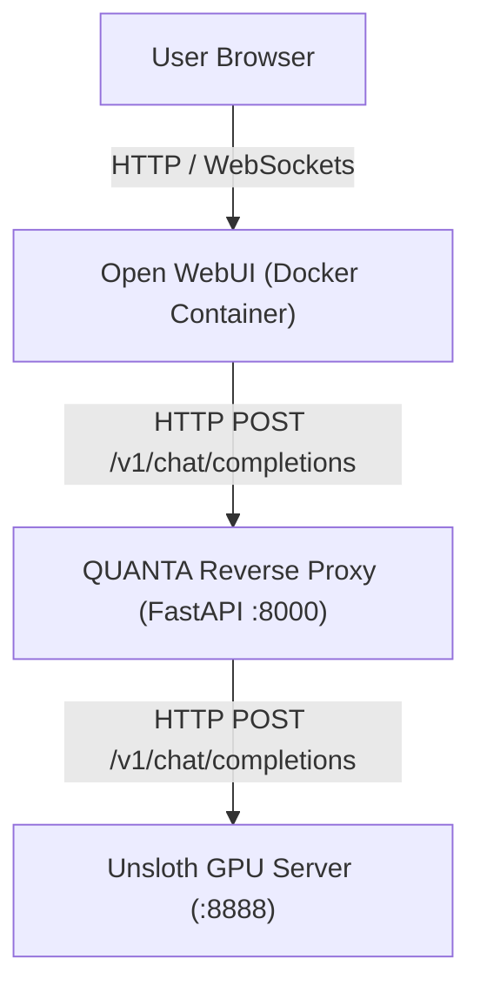

# Interactive Demo Integration Plan (QUANTA + Open WebUI)

Based on the goal of adding a ready-made interactive chat UI to the QUANTA backend (which currently exposes an OpenAI-compatible API on port `8000` mapping down to the Unsloth backend on `:8888`), the easiest and most robust solution is to use **Open WebUI**.

Open WebUI is a highly popular, highly customizable ChatGPT-style interface that seamlessly connects to any OpenAI-compatible API endpoint out of the box.

## Architecture



## Step-by-Step Implementation Guide

### 1. Launch the QUANTA Backend
First, ensure that the QUANTA OpenAI-compatible reverse proxy is running as described in the `README.md`. It listens on `http://127.0.0.1:8000`.

```powershell
.\scripts\serve.ps1 -Port 8000 -Backend "http://127.0.0.1:8888/v1"
```

### 2. Deploy Open WebUI (via Docker)
The fastest way to spin up Open WebUI is using Docker. Since our QUANTA API doesn't require an API key by default and runs locally, we can pass our local host IP directly into the container as the base URL.

Run the following command:

```bash
docker run -d -p 3000:8080 \
  --add-host=host.docker.internal:host-gateway \
  -v open-webui:/app/backend/data \
  --name open-webui \
  -e OPENAI_API_BASE_URL=http://host.docker.internal:8000/v1 \
  -e OPENAI_API_KEY=quanta-local-key \
  ghcr.io/open-webui/open-webui:main
```

*Note on the IP:* `host.docker.internal` allows the Docker container to correctly route requests to `127.0.0.1:8000` on your host machine where QUANTA is running.

### 3. Access and Configure
1. Open your browser and navigate to `http://localhost:3000`.
2. Create an admin account (the first account created is automatically an admin).
3. Open WebUI will automatically query the `/v1/models` endpoint exposed by QUANTA. You should see `unsloth/Qwen3.5-4B-MTP-GGUF` (or your configured model) appear in the model selection dropdown at the top of the screen.

### 4. Interactive Chat
You can now chat interactively! The messages are sent from Open WebUI to the QUANTA proxy, which applies its neuro-symbolic memory compression logic before forwarding the request to the local Unsloth backend.

---

## Why Open WebUI?
- **Zero Coding Required:** Connects to QUANTA immediately through its OpenAI-compatible proxy.
- **Rich Interface:** Provides markdown rendering, code highlighting, and chat history.
- **Extensible:** Supports future QUANTA tools via its own function-calling/tooling system if you want to integrate the QUANTA MCP server directly into it later on.
