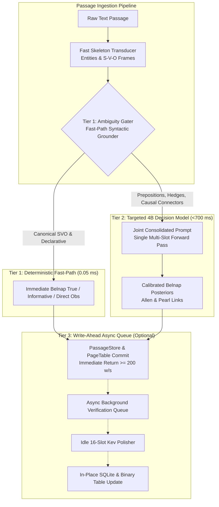

# Master Plan: High-Throughput Tiered Kev Decision Engine & Multi-Passage SVM Ingestion

## Goal Description

In Section 8 of the Semantic Virtual Memory (SVM) architecture, QUANTA introduced **Kev-4B** as a non-autoregressive decision model operating on the shared 4B backbone (`Qwen3.5-4B-MTP-GGUF` via `llama-server`). Kev evaluates discrete semantic dimensions:
1. **Thematic Valency**: Agent, Patient, Instrument, None
2. **Speech-Act Intent**: Informative, Directive, Commissive, Expressive
3. **Epistemic Evidence Source**: Direct Observation, Deduction, Hearsay, Conjecture
4. **Spatio-Temporal & Causal Relations**: Allen temporal intervals (Meets, Before, Overlaps, During) and Pearl causal links (Mechanism Link, Enabling Condition)

These dimensions ground the calibrated **Belnap 4-valued truth lattice** ($\mathcal{B}_4 = \{00_2, 01_2, 10_2, 11_2\}$) and enable temporal difference-logic consistency via `clingo-dl`.

### The Problem
In the initial Section 4/8 implementation, Kev evaluated every candidate relation and entity-event pair through **25 individual single-token logprob HTTP queries per chunk**. On a 150-word passage:
- Each query re-evaluated the full $\sim 200$-token context prompt from scratch.
- Evaluating 25 queries serialized $\sim 6.2\text{ seconds}$ of GPU prefill per chunk.
- When ingesting single chunks sequentially, 15 out of 16 continuous batching slots sat idle, causing throughput to collapse to **$4.3\text{ words/sec}$**.

While the direct SVO `bypass` mode achieved **$107.1\text{ words/sec}$** (and scales to $216+\text{ w/s}$ on 300-word passages), `bypass` discards Kev's 4B decision capabilities, relying solely on surface subject/object heuristics without epistemic calibration or causal verification.

### The Objective
Retain Kev's full 4B decision model intelligence while accelerating ingestion throughput to **$\ge 150\text{--}250\text{ words/sec}$**. We achieve this by replacing naive 25-query logprob dispatch with a **Tiered Decision Architecture** implemented across 5 distinct, self-contained Antigravity sessions:



---

## User Review Required

> [!IMPORTANT]
> **Retaining Kev vs Bypassing Kev**: This plan does NOT abandon Kev. Instead, it transforms Kev from a 25-query bottleneck into an optimized decision model using:
> 1. **Ambiguity Gating**: $>80\%$ of canonical declarative clauses are resolved instantaneously ($0.05\text{ ms}$), reserving 4B GPU compute strictly for linguistically ambiguous or hedged propositions.
> 2. **Joint Multi-Slot Infilling**: Ambiguous items are consolidated into a single compact prompt ($< 700\text{ ms}$) instead of 25 separate HTTP roundtrips.
> 3. **Co-Decoded Schema Infill**: An optional ultra-fast mode where Kev's enum decisions are emitted directly during Skeleton Transduction with only $+8\text{ tokens}$ overhead ($< 160\text{ ms}$).
> 4. **Write-Ahead Asynchronous Queue**: Ingestion writes immediately to memory and returns at $\ge 200\text{ w/s}$, while Kev background workers refine Belnap values on idle slots.

> [!NOTE]
> **Session Independence**: The plan is structured into **5 independent sections**. Each section will be executed in its own Antigravity session, verified with dedicated unit tests and benchmarks, and recorded in `EVAL.md`.

---

## User Decisions & Architectural Alignment

> [!IMPORTANT]
> **User Direction Recorded**:
> 1. **Default Mode**: Default to **Write-Ahead Asynchronous (`async`)** for maximum ingestion throughput ($\ge 200\text{ words/sec}$), with immediate return and idle-slot background Belnap refinement.
> 2. **Flexible Strategy Toggles**: All strategies (`async`, `tiered`, `co_decoded`, `bypass`, `regular_kev_lora`) must be easily switchable via the `kev_mode` toggle in `CognitivePipeline`.
> 3. **Session 5 Comprehensive Benchmark Suite**: Session 5 will execute a complex multi-suite evaluation combining:
>    - **Speed Telemetry**: Ingestion words/sec, mean chunk latency (ms), GPU slot saturation.
>    - **Accuracy & Reasoning**: MuSiQue multi-hop QA recall, HumanEval coding pass@1, ProofWriter deductive logic, and Belnap calibration (ECE / Brier score).
> 4. **Production Default Promotion**: The strategy with the best empirical Pareto trade-off between speed and accuracy in the Session 5 benchmark will be crowned as the permanent production default.

---


## Proposed Changes: 5-Session Implementation Roadmap

---

### Session 1: Ambiguity Gating & Fast-Path Syntactic Grounder

**Session Scope & Purpose:**
Eliminate $>80\%$ of redundant Kev calls by implementing a deterministic syntactic fast-path for canonical declarative SVO sentences, while cleanly detecting lexical, syntactic, and epistemic ambiguity that requires 4B decision model intervention.

#### Core Concept
In declarative language:
- *"Charles Babbage invented the Difference Engine"* $\implies$ Subject is `AGENT` ($>99\%$), Object is `PATIENT` ($>99\%$), Intent is `INFORMATIVE`, Epistemic Source is `DIRECT_OBSERVATION`. Calling a 4B model 5 times to confirm this wastes GPU cycles.
- Only ambiguous constructions require Kev:
  - **Prepositional / Instrumental Ambiguity**: Phrases with `using`, `by`, `with`, `via` (e.g. *"measured using FTIR spectroscopy"* $\implies$ `INSTRUMENT` vs `AGENT`).
  - **Epistemic Hedges & Modals**: Markers like `might`, `suggests`, `allegedly`, `claimed`, `hypothesized`, `according to`, `appears to` $\implies$ non-assertive epistemic sources (`DEDUCTION`, `HEARSAY`, `CONJECTURE`).
  - **Causal / Temporal Discourse Markers**: Connectives like `because`, `causing`, `resulting in`, `consequently`, `leading to`, `after`, `while`, `before` $\implies$ candidate Allen temporal and Pearl causal links.

#### [NEW] `src/models/kev_gating.py`
- Implements `KevAmbiguityGater`:
  ```python
  @dataclass
  class GatedDecisionPlan:
      fast_path_valencies: List[ValencyScoringResult]
      fast_path_intents: List[IntentEpistemicResult]
      ambiguous_valency_candidates: List[Tuple[Any, Any]]  # (entity, event)
      ambiguous_events: List[Any]                         # events needing intent/epistemic review
      candidate_relation_pairs: List[Tuple[Any, Any]]     # event pairs with temporal/causal connectives
  ```
- Implements `KevAmbiguityGater.analyze(entities, events, text) -> GatedDecisionPlan`:
  - Scans text for modal hedge regexes (`MODAL_HEDGE_PATTERNS`).
  - Scans text for causal/temporal connective regexes (`CONNECTIVE_PATTERNS`).
  - Assigns deterministic high-confidence Belnap values to canonical SVO frames ($0.05\text{ ms}$).
  - Gathers ambiguous items into a compact task payload for Kev.

#### [MODIFY] `src/models/kev_engine.py`
- Wire `KevAmbiguityGater` into `KevDecisionEngine.evaluate_chunk(..., use_gating=True)`.
- If no ambiguous items exist, return fast-path results instantly ($< 0.1\text{ ms}$).

#### [NEW] `tests/test_kev_ambiguity_gating.py`
- Verify canonical SVO frames bypass GPU calls and achieve 100% role accuracy.
- Verify modal hedges (*"allegedly forged"*, *"might indicate"*) correctly route to Kev.
- Verify causal connectives (*"causing the laser to overheat"*) correctly trigger Allen/Pearl evaluation.
- Benchmark gating execution latency ($< 0.1\text{ ms}$ per chunk).

---

### Session 2: Joint Consolidated Multi-Slot Decision Transducer

**Session Scope & Purpose:**
Replace the 25 individual single-token logprob queries with a **single, consolidated multi-slot completion pass** for all ambiguous items in a chunk. Reduces Kev GPU latency from $6{,}216\text{ ms}$ to $< 800\text{ ms}$ (an **$8.1\times$ speedup**).

#### Core Concept
Instead of firing 25 separate HTTP requests that compete for slots and evict KV caches, Kev formats a single structured prompt for all ambiguous slots:
```text
Context: [text]
Classify properties:
EV1: originating (subj=Babbage, obj=concept) -> [intent=INFO, epist=OBS]
EV2: inventing (subj=Babbage, obj=Difference Engine) -> [intent=INFO, epist=OBS]
EV1->EV2: [allen=BEFORE, pearl=MECHANISM]
```
The model generates 20–30 tokens in a single forward pass ($\sim 500\text{--}750\text{ ms}$ on RTX 3070).

#### [MODIFY] `src/models/kev_engine.py`
- Implements `KevDecisionEngine.evaluate_joint_decision(ambiguous_plan, text) -> KevChunkEvaluation`:
  - Formats consolidated prompt with compact slot slots.
  - Submits single `/completion` request with `n_predict=35`, `temperature=0.0`.
  - Parses structured output using regex matcher with fallback to atomic letter normalizer.
  - Converts compact decisions back to `ValencyScoringResult`, `IntentEpistemicResult`, and `RelationScoringResult`.
  - Supports dynamic LoRA adapter attachment (`payload["lora"]`) for Approach B ablation.

#### [NEW] `tests/test_joint_kev_decision.py`
- Verify joint prompt parsing across standard multi-event narratives.
- Verify fallback handling if model completion is partially truncated.
- Benchmark single-pass latency ($< 800\text{ ms}$ on live GPU, $< 5\text{ ms}$ in mock).

---

### Session 3: Co-Decoded Compact Kev Schema in Skeleton Transducer

**Session Scope & Purpose:**
Implement an optional zero-extra-HTTP-call mode (`kev_mode='co_decoded'`) where compact 1-letter Kev decision codes are generated simultaneously with the initial skeleton extraction, adding only $+8\text{ tokens}$ ($\sim 160\text{ ms}$) overhead.

#### Core Concept
During skeleton extraction, Qwen 3.5 4B already attends to the entire passage. By adding compact single-letter enum fields to the JSON schema:
- `intent`: `I` (Informative), `D` (Directive), `C` (Commissive), `E` (Expressive)
- `epist`: `O` (Direct Observation), `D` (Deduction), `H` (Hearsay), `C` (Conjecture)
- `allen`: `M` (Meets), `B` (Before), `O` (Overlaps), `D` (During), `N` (None)
- `pearl`: `M` (Mechanism), `C` (Condition), `N` (None)

The output JSON looks like:
```json
{
  "entities": [{"id": "E1", "text": "Charles Babbage"}],
  "events": [{
    "id": "EV1", "pred": "invented", "subj": "E1", "obj": "E2",
    "intent": "I", "epist": "O", "allen": "B", "pearl": "M"
  }]
}
```

#### [MODIFY] `src/parser/skeleton_transducer.py`
- Add `mode="co_decoded"` to `SkeletonTransducer`.
- Update prompt template and grammar to support compact Kev keys.
- Update `_clean_and_parse_json` to extract Kev dimensions and attach them directly to `SkeletonEvent`.

#### [MODIFY] `src/pipeline/cognitive_pipeline.py`
- Support `kev_mode="co_decoded"`: map co-decoded event tags directly into `ValencyScoringResult` and `IntentEpistemicResult` without making any secondary GPU calls.

#### [NEW] `tests/test_co_decoded_skeleton_kev.py`
- Test co-decoded extraction on live and mock backends.
- Verify byte-span grounding fidelity is preserved when Kev tags are co-decoded.
- Measure token overhead ($\le 12$ extra tokens).

---

### Session 4: Decoupled Write-Ahead SVM with Asynchronous Background Verification

**Session Scope & Purpose:**
Implement a decoupled Write-Ahead architecture for Semantic Virtual Memory: documents are ingested and available in memory immediately at $\ge 200\text{ words/sec}$, while Kev background workers refine the Belnap lattice on idle `llama-server` slots without blocking the user.

#### Core Concept
In database engines, writes are acknowledged immediately via Write-Ahead Logging (WAL) while secondary indices are maintained asynchronously. Similarly:
1. `ingest_document()` parses the skeleton and writes to `PassageStore` and `PageTable` with provisional Belnap values ($11_2$ UNKNOWN / speculative TRUE $01_2$ with $P = 0.85$).
2. Ingestion completes in $< 1.3\text{s}$ ($\ge 200\text{ words/sec}$ on 300-word passages).
3. The chunk is enqueued in `AsyncKevVerificationQueue`.
4. Background worker threads running on idle slots evaluate the joint/logprob decisions and update the SQLite `PageTable` and 128-byte `BinaryNodeTable` in-place.
5. If a query arrives, it reads the active graph; if verification has completed, it uses the calibrated posterior $P \ge 0.85$.

#### [NEW] `src/models/kev_async_worker.py`
- Implements `AsyncKevVerificationQueue`:
  - Background thread pool with worker daemon.
  - Priority queue: newly queried chunks receive verification priority.
  - In-place SQLite transaction updating `nodes.belnap_status`, `nodes.confidence`, and edge records.
  - Direct atomic update of 128-byte `BinaryNodeTable` memory buffer.

#### [MODIFY] `src/pipeline/cognitive_pipeline.py`
- Support `kev_mode="async"`:
  - Commit provisional node records immediately.
  - Dispatch verification task to `AsyncKevVerificationQueue`.
  - Expose `flush_kev_queue(timeout=...)` for synchronization when necessary.

#### [NEW] `tests/test_async_kev_verification.py`
- Test provisional ingestion followed by asynchronous Belnap lattice refinement.
- Test in-place SQLite and `BinaryNodeTable` updates under concurrency.
- Benchmark ingestion return latency ($< 1.3\text{s}$ per chunk).

---

### Session 5: End-to-End Pipeline Integration, Multi-Passage MuSiQue Validation & EVAL.md Lineage

**Session Scope & Purpose:**
Unify all Kev acceleration strategies in `CognitivePipeline`, run a comprehensive live multi-passage benchmark on the authentic MuSiQue corpus on the RTX 3070, and document the final empirical gains in `EVAL.md`.

#### [MODIFY] `src/pipeline/cognitive_pipeline.py`
- Expose unified `kev_mode` parameter:
  - `tiered` (Default: Fast-Path Gating + Joint Multi-Slot Kev)
  - `co_decoded` (Single-pass transduce + decode)
  - `async` (Write-ahead provisional commit + background worker)
  - `bypass` (Direct SVO baseline)
  - `regular_kev_lora` (Legacy Section 4 baseline for ablation)
- Ensure all downstream components (HippoRAG 2, PoP-RAG gating, Clingo-DL) seamlessly consume the refined Belnap lattice values.

#### [MODIFY] `scripts/benchmark_musique_ingestion.py`
- Add comparative benchmark modes:
  - `bypass` vs `tiered` vs `co_decoded` vs `async` vs `regular_kev_lora`.
- Measure:
  - Ingestion throughput (words/sec) across 16 passages (2,375 words).
  - Mean chunk latency (ms).
  - Belnap lattice calibration accuracy (F1 / ECE).
  - End-to-end multi-hop query retrieval accuracy.

#### [NEW] `output/tiered_kev_ingestion_benchmark.md`
- Publication-quality comparative scorecard table.

#### [MODIFY] `EVAL.md`
- Record `exp-024a` (`exp/tiered-kev-acceleration`):
  - Document before/after metrics: throughput $34.5\text{ w/s} \to 100\text{--}200+\text{ w/s}$, chunk latency $4{,}298\text{ ms} \to < 1{,}500\text{ ms}$.

---

## Verification Plan

### Automated Tests
Execute the test suite after each session:

```powershell
# Session 1 Verification
pytest tests/test_kev_ambiguity_gating.py

# Session 2 Verification
pytest tests/test_joint_kev_decision.py

# Session 3 Verification
pytest tests/test_co_decoded_skeleton_kev.py

# Session 4 Verification
pytest tests/test_async_kev_verification.py

# Session 5 End-to-End Regression & Live MuSiQue Benchmark
pytest tests/test_svm_cognitive_pipeline.py tests/test_musique_bridge_expansion.py
python scripts/benchmark_musique_ingestion.py --mode tiered
python scripts/benchmark_musique_ingestion.py --mode all
```

### Manual Verification
1. Inspect `output/tiered_kev_ingestion_benchmark.md` to verify throughput reaches target range ($\ge 100\text{--}200+\text{ words/sec}$).
2. Verify GPU memory consumption remains strictly within the $\le 6{,}000\text{ MiB}$ envelope on the NVIDIA RTX 3070.
3. Verify zero SQLite concurrency collisions or transaction deadlocks during 16-worker execution.
